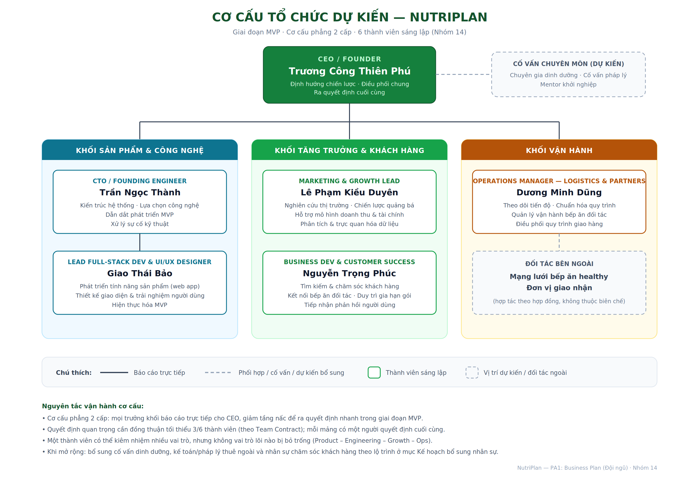

# Task 5 — Cơ cấu tổ chức nhóm/startup dự kiến

*(Task 5 — PA1: Business Plan Document, phần Đội ngũ — Nhóm 14, dự án NutriPlan)*

> Người thực hiện: Lê Phạm Kiều Duyên

## 1. Mô hình tổ chức lựa chọn

Trong giai đoạn hiện tại (xây dựng MVP và kiểm chứng mô hình kinh doanh), NutriPlan lựa chọn **mô hình tổ chức phẳng gồm 2 cấp**: CEO điều phối chung ở cấp thứ nhất, và các trưởng khối chức năng báo cáo trực tiếp cho CEO ở cấp thứ hai. Nhóm chủ động không thiết kế nhiều tầng quản lý trung gian vì ba lý do:

- **Quy mô nhỏ (6 thành viên sáng lập):** thêm tầng nấc chỉ làm tăng chi phí giao tiếp mà không tăng năng suất. Cơ cấu phẳng giúp thông tin từ khách hàng, từ bếp ăn đối tác đến được người ra quyết định trong thời gian ngắn nhất.
- **Yêu cầu tốc độ của giai đoạn MVP:** startup ở giai đoạn tìm kiếm mô hình kinh doanh cần thử nghiệm và điều chỉnh nhanh; mỗi quyết định về sản phẩm, giá gói, hay đối tác đều cần được chốt trong vòng vài ngày thay vì vài tuần.
- **Đảm bảo không vai trò lõi nào bị bỏ trống:** cơ cấu được thiết kế bám theo 4 nhóm chức năng lõi của một startup CNTT giai đoạn sớm — Product/Engineering, Growth/Sales, Customer Success và Ops — mỗi nhóm đều có owner rõ ràng, một người có thể kiêm nhiệm nhưng không mảng nào "vô chủ".

## 2. Sơ đồ tổ chức

Sơ đồ gồm 3 khối chức năng trực thuộc CEO, kèm các vị trí cố vấn dự kiến bổ sung (đường nét đứt) và đối tác bên ngoài không thuộc biên chế:

| Khối | Thành viên & vai trò | Trách nhiệm chính |
|---|---|---|
| **Điều hành** | Trương Công Thiên Phú — CEO/Founder | Định hướng chiến lược, phân công công việc, theo dõi tiến độ, ra quyết định cuối cùng khi có bất đồng |
| **Sản phẩm & Công nghệ** | Trần Ngọc Thành — CTO/Founding Engineer; Giao Thái Bảo — Lead Full-stack Developer & UI/UX Designer | Thiết kế kiến trúc hệ thống, lựa chọn công nghệ, phát triển toàn bộ tính năng của web app NutriPlan (tính toán TDEE/Macro, lập thực đơn, đặt gói định kỳ), thiết kế giao diện và trải nghiệm người dùng |
| **Tăng trưởng & Khách hàng** | Lê Phạm Kiều Duyên — Marketing & Growth Lead; Nguyễn Trọng Phúc — Business Development & Customer Success | Nghiên cứu thị trường, xây dựng chiến lược tiếp cận khách hàng và quảng bá sản phẩm; tìm kiếm khách hàng, kết nối bếp ăn đối tác, chăm sóc và duy trì tỷ lệ gia hạn gói — yếu tố sống còn của mô hình subscription |
| **Vận hành** | Dương Minh Dũng — Operations Manager (Logistics & Partners) | Theo dõi tiến độ dự án, chuẩn hóa quy trình làm việc nội bộ; về dài hạn quản lý vận hành mạng lưới bếp ăn đối tác và quy trình giao suất ăn hằng ngày |

Trong khối Sản phẩm & Công nghệ, Bảo báo cáo trực tiếp cho Thành (CTO) để đảm bảo tính nhất quán về kiến trúc và chất lượng kỹ thuật. Duyên và Phúc là hai vai trò ngang cấp trong khối Tăng trưởng & Khách hàng, phối hợp chặt với nhau theo phễu khách hàng: Duyên phụ trách phần đầu phễu (thu hút, chuyển đổi), Phúc phụ trách phần cuối phễu (chốt, chăm sóc, gia hạn).

## 3. Cơ chế phối hợp và ra quyết định

Cơ cấu tổ chức chỉ có ý nghĩa khi đi kèm luật chơi rõ ràng. Nhóm kế thừa các nguyên tắc đã cam kết trong Team Contract (PA0) và cụ thể hóa cho cơ cấu này như sau:

- **Quyết định quan trọng** (chốt ý tưởng, thay đổi tính năng lớn, điều chỉnh mô hình giá, phân chia lại công việc): thảo luận tập thể và cần đồng thuận tối thiểu **3/6 thành viên**.
- **Quyết định chuyên môn trong từng mảng:** trưởng khối là người quyết định cuối cùng (final decision maker) — CTO quyết các vấn đề kỹ thuật, Marketing & Growth Lead quyết các vấn đề quảng bá, Operations Manager quyết quy trình vận hành. CEO chỉ can thiệp khi quyết định ảnh hưởng liên khối hoặc khi các bên không thống nhất được.
- **Nhịp vận hành:** họp định kỳ hằng tuần (thứ Bảy, qua Google Meet) để chốt mục tiêu tuần và owner cho từng đầu việc; công việc được quản lý theo outcome đo được thay vì chỉ theo task.
- **Kênh phối hợp:** Messenger cho trao đổi hằng ngày, Google Drive cho tài liệu, GitHub cho mã nguồn với quy trình Pull Request và code review bắt buộc.

## 4. Quan hệ với đối tác bên ngoài

Đặc thù mô hình NutriPlan là **không tự vận hành bếp ăn** mà kết nối với mạng lưới bếp healthy và đơn vị giao nhận. Các đối tác này nằm ngoài biên chế startup (thể hiện bằng nét đứt trong sơ đồ) và được quản lý qua hai đầu mối: Phúc (Business Development) phụ trách tìm kiếm, đàm phán và thiết lập quan hệ hợp tác; Dũng (Operations Manager) phụ trách vận hành hằng ngày — điều phối đơn hàng, kiểm soát chất lượng định lượng dinh dưỡng và quy trình giao hàng. Việc tách bạch "người mở quan hệ" và "người vận hành quan hệ" giúp tránh xung đột vai trò và đảm bảo trách nhiệm rõ ràng khi có sự cố với đối tác.

## 5. Định hướng phát triển cơ cấu theo giai đoạn

Cơ cấu trên là cơ cấu cho **giai đoạn MVP (hiện tại)**. Nhóm dự kiến cơ cấu sẽ tiến hóa theo hai giai đoạn tiếp theo:

- **Giai đoạn kiểm chứng thị trường (sau MVP):** bổ sung các vị trí cố vấn bán thời gian — đặc biệt là **chuyên gia dinh dưỡng** để kiểm chứng độ chính xác của thuật toán TDEE/Macro và thực đơn (rủi ro chuyên môn lớn nhất đã nhận diện ở PA0), cùng cố vấn pháp lý cho các vấn đề an toàn thực phẩm và hợp đồng đối tác.
- **Giai đoạn tăng trưởng:** khi lượng khách hàng và bếp ăn đối tác tăng, khối Vận hành và khối Khách hàng sẽ được ưu tiên bổ sung nhân sự trước (cộng tác viên chăm sóc khách hàng, điều phối giao nhận), vì đây là hai khối chịu tải trực tiếp theo số lượng đơn hàng; các chức năng kế toán — thuế dự kiến thuê ngoài để giữ bộ máy tinh gọn.

Chi tiết các vị trí còn thiếu và kế hoạch bổ sung nhân sự, cố vấn, đối tác được trình bày ở hai mục tiếp theo của Business Plan (Task 6 và Task 7).
