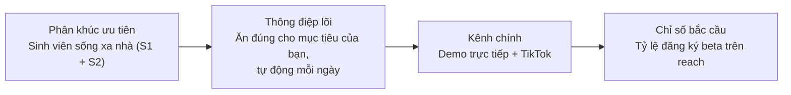
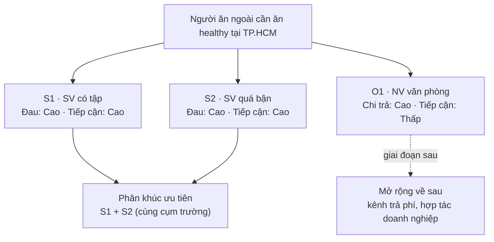

# Hạng mục 2: Phân khúc khách hàng chính

**Người phụ trách:** Lê Phạm Kiều Duyên (Marketing và Growth Lead)
**Liên quan:** Hạng mục 2 trong `phan-cong-PA3.md`
**Kế thừa:** PA2 (chân dung khách hàng mục tiêu ở `docs/PA2-san-pham/03-chan-dung-khach-hang-muc-tieu.md`, USP ở `docs/PA2-san-pham/06-diem-khac-biet-thi-truong.md`); khung segmentation Tuần 4
**Hạn:** 23h tối 16/7
**Trạng thái:** Hoàn thành

---

## Tóm tắt quyết định

Nhóm cắt thị trường theo hành vi thành ba phân khúc và chốt phân khúc ưu tiên số một là sinh viên sống xa nhà quanh một cụm trường đại học tại TP.HCM. Đây là phân khúc đủ đau, dễ tiếp cận nhất trong một chiến dịch ngắn ngày và có khả năng trở thành khách hàng tham chiếu để lan tỏa. Nhân viên văn phòng trẻ được giữ lại làm phân khúc mở rộng ở giai đoạn sau. Quyết định này là đầu vào cho thông điệp (hạng mục 4), kênh (hạng mục 5) và đối tượng chạy chiến dịch (hạng mục 11).

## Bức tranh tổng thể marketing (một màn hình)

Toàn bộ mạch marketing của PA3 gói trong một dòng chảy: chọn đúng người, nói đúng lời hứa, gặp ở đúng kênh, đo bằng đúng chỉ số.

Sơ đồ chọn phân khúc ưu tiên, đọc nhanh vì sao gộp S1 và S2 và lùi O1:

## 1. Các phân khúc xét đến

Thay vì chia thị trường theo nhân khẩu học đơn thuần như tuổi và giới tính, nhóm chia theo hành vi và nhu cầu, bám vào ba persona đã dựng ở PA2. Ba persona đó không phải ba cá nhân rời rạc mà đại diện cho ba nhóm hành vi khác nhau, mỗi nhóm có use case và nỗi đau riêng.

| Ký hiệu | Phân khúc hành vi | Persona đại diện (PA2) | Nhu cầu cốt lõi |
|---|---|---|---|
| S1 | Sinh viên sống xa nhà có tập luyện thể thao | Nguyễn Thành Tiến (nam, năm 3 CNTT) | Ăn đủ protein đúng mục tiêu để tập có kết quả, bữa tự đến kể cả mùa deadline |
| S2 | Sinh viên sống xa nhà quá bận, không tập được | Đoàn Tú Uyên (nữ, năm 2 Y) | Đủ dinh dưỡng giữ sức qua lịch học và lịch trực dày, không tụt sức mùa thi |
| O1 | Nhân viên văn phòng trẻ mới đi làm | Trần Nhật Huyền (nữ, 24, nhân sự) | Bữa trưa và tối lành mạnh để giảm cân, khỏi phải chọn món mỗi ngày |

Cả ba nhóm có chung bốn đặc điểm: ăn ngoài gần như toàn bộ số bữa, quỹ thời gian eo hẹp, đã quen đặt đồ ăn và thanh toán trực tuyến, có lý do sức khỏe rõ ràng để thay đổi. Điểm khác nhau giữa họ là mục tiêu (tăng cơ, giữ sức hay giảm cân), và đây chính là thứ mà hồ sơ dinh dưỡng cá nhân của NutriPlan xử lý được (USP 1). Vì vậy sự khác biệt hành vi không làm loãng sản phẩm mà lại là lý do sản phẩm tồn tại.

## 2. Bảng phân khúc theo bốn tiêu chí hành vi

Chấm theo bốn tiêu chí của khung Tuần 4, thang Cao, Trung bình, Thấp.

| Tiêu chí | S1 (SV có tập) | S2 (SV quá bận) | O1 (NV văn phòng) |
|---|---|---|---|
| Use case (dùng để làm gì, tần suất) | Suất ăn đủ protein cho mục tiêu tăng cơ, đặt gần như hằng ngày, cao điểm mùa deadline | Suất ăn cân bằng vi chất để giữ sức, đặt hằng ngày theo lịch học và lịch trực | Bữa trưa và tối giảm cân, đặt các ngày trong tuần làm việc |
| Mức độ đau | Cao. Tập nhiều mà không tiến bộ vì ăn thất thường, không biết Calo và protein đang nạp | Cao. Không tập được nên ăn uống là cách duy nhất giữ sức, hay bỏ bữa và sụt cân mùa thi | Trung bình đến Cao. Biết ăn nhiều dầu mỡ nhưng chưa nguy cấp, đau kiểu dai dẳng hơn là cấp bách |
| Khả năng chi trả | Trung bình. Ngân sách ăn 2,5-3 triệu/tháng, chấp nhận 40-60 nghìn/bữa, cân nhắc kỹ trước khi trả cả gói | Thấp đến Trung bình. 2-2,5 triệu/tháng, 35-55 nghìn/bữa, so sánh kỹ với cơm căng tin | Cao. Thu nhập khoảng 13 triệu/tháng, chấp nhận 50-80 nghìn/bữa, đã quen trả phí subscription |
| Khả năng tiếp cận (gặp được trong thời gian chiến dịch) | Cao. Tập trung theo cụm trường, gặp qua lớp, câu lạc bộ, phòng gym trường, group môn học | Cao. Cùng cụm trường, gặp qua lớp, ký túc xá, group lớp và group ngành | Thấp đến Trung bình. Phân tán theo tòa văn phòng nhiều quận, khó demo trực tiếp trong thời gian ngắn |

Đọc bảng theo cột thấy rõ: S1 và S2 nổi trội ở mức độ đau và khả năng tiếp cận, đúng hai tiêu chí quyết định cho một chiến dịch ngân sách gần bằng không và thời gian rất ngắn. O1 thắng ở khả năng chi trả nhưng lại yếu nhất ở tiếp cận, mà tiếp cận là thứ nhóm không thể bù bằng tiền trong một chiến dịch ngắn ngày.

## 3. Phân khúc ưu tiên số một

**Chọn: sinh viên sống xa nhà quanh một cụm trường đại học tại TP.HCM, gồm hai nhóm hành vi S1 và S2.**

S1 và S2 vẫn là hai nhóm hành vi khác nhau về nhu cầu, nhưng nhóm gộp chúng thành một phân khúc ưu tiên vì một lý do vận hành: cả hai sống và học trong cùng một không gian vật lý (cùng cụm trường, ký túc xá, group môn học), nên tiếp cận được bằng cùng một kênh và cùng một buổi demo. Việc gộp không làm loãng thông điệp, vì phần cá nhân hóa giữa tăng cơ và giữ sức do sản phẩm lo. Ở tầng truyền thông, ba biến thể thông điệp ở hạng mục 4 sẽ đo xem lợi ích nào (tiết kiệm thời gian, sức khỏe, chi phí) kéo được cả hai nhóm mạnh nhất.

Xét theo bốn tiêu chí:

- Use case rõ và lặp lại hằng ngày. Cả hai nhóm ăn ngoài gần như toàn bộ số bữa, tần suất cao, đúng bản chất dịch vụ gói định kỳ của NutriPlan chứ không phải nhu cầu ăn healthy thỉnh thoảng.
- Đủ đau. Đây là nhóm đau nhất và cấp bách nhất. Ăn thất thường trực tiếp phá kết quả tập luyện (S1) hoặc bào mòn sức khỏe khi không còn cách nào khác để bù (S2). Nỗi đau càng cấp thì thông điệp càng dễ chạm và tỷ lệ chuyển đổi càng cao.
- Dễ tiếp cận nhất trong một chiến dịch ngắn ngày. Sinh viên tập trung theo cụm, gặp được trực tiếp qua lớp và câu lạc bộ với chi phí gần bằng không. Đây là yếu tố quyết định khi thời gian chạy thật có hạn.
- Khả năng chi trả tuy chỉ trung bình nhưng đã đủ ngưỡng. Mức 35-60 nghìn/bữa nằm trong tầm giá gói mà NutriPlan thiết kế, và gói dùng thử 1-2 ngày lẻ (USP 3) hạ đúng rào cản cân nhắc kỹ trước khi trả cả gói của nhóm này.

Vì sao nhóm này là khách hàng tham chiếu tốt:

- Sinh viên trong cùng cụm trường có mạng lưới xã hội dày và chồng lấn (bạn cùng lớp, cùng phòng, cùng câu lạc bộ, cùng group ngành), nên một khách hài lòng dễ kéo theo nhiều khách khác. Đây là điều kiện thuận lợi cho growth loop giới thiệu ở hạng mục 6.
- Nhóm này hoạt động mạnh trên mạng xã hội (TikTok, Facebook group, Zalo), giúp khuếch đại bằng chứng cộng đồng, phục vụ trực tiếp chỉ số Referral trong phễu ở hạng mục 9.
- Một cụm trường là thị trường thử nghiệm khép kín: dễ đo mức lan truyền, dễ vận hành giao hàng theo tuyến (khớp với Routing Engine ở USP 4), và cũng chính là con số SOM giai đoạn MVP mà hạng mục 1 khoanh vùng.

## 4. Phân khúc lùi lại giai đoạn sau

**Chọn lùi: nhân viên văn phòng trẻ (O1, persona Trần Nhật Huyền).**

Lý do lùi lại thay vì loại bỏ:

- Khó tiếp cận trong một chiến dịch ngắn. Nhóm này phân tán theo nhiều tòa văn phòng ở các quận khác nhau, không có cụm như sinh viên, nên không thể demo trực tiếp hàng loạt trong thời gian chiến dịch với ngân sách gần bằng không.
- Nỗi đau dai dẳng hơn là cấp bách. Họ biết mình ăn nhiều dầu mỡ nhưng chưa ở mức bắt buộc phải đổi ngay, nên chu kỳ ra quyết định dài hơn, không hợp với một chiến dịch kiểm chứng nhu cầu ngắn.

Nhóm vẫn giữ phân khúc này trong chiến lược vì đây là nhóm có khả năng chi trả cao nhất và đã quen mô hình subscription, nên là nguồn doanh thu ổn định khi mở rộng. Cách tiếp cận phù hợp ở giai đoạn sau là kênh trả phí và hợp tác doanh nghiệp thay cho demo trực tiếp, làm sau khi đã có bằng chứng chuyển đổi và bộ nội dung được kiểm chứng từ phân khúc sinh viên. Thứ tự ưu tiên này nhất quán với PA2, nơi sinh viên là phân khúc chính còn nhân viên văn phòng là phân khúc thứ hai.

## 5. Nhất quán với các hạng mục khác

- Hạng mục 1 (thị trường mục tiêu): SOM giai đoạn MVP khoanh vào một đến hai cụm trường, chính là phân khúc ưu tiên chốt ở đây.
- Hạng mục 3 (chân dung điển hình): persona đại diện cho phân khúc ưu tiên sẽ được chọn từ nhóm S1 hoặc S2, không phải O1.
- Hạng mục 4 (thông điệp): ba biến thể thông điệp được viết và dự đoán thắng dựa trên nỗi đau của phân khúc sinh viên này.
- Hạng mục 5 (kênh): kênh chính là demo trực tiếp tại lớp và câu lạc bộ, chọn được nhờ đặc điểm tập trung theo cụm của phân khúc ưu tiên.
- Hạng mục 6 và 11 (khách hàng đầu tiên, chiến dịch): đối tượng demo và thu phản đối trong chiến dịch 7 ngày chính là sinh viên trong cụm trường này.

## 6. Tiêu chí hoàn thành (tự đối chiếu)

- [x] Có bảng phân khúc theo đủ bốn tiêu chí hành vi.
- [x] Chốt đúng một phân khúc ưu tiên với lập luận theo bốn tiêu chí.
- [x] Cắt theo hành vi, không dừng ở nhân khẩu học.
- [x] Nhất quán với chân dung (hạng mục 3) và thông điệp (hạng mục 4), có lý do vì sao lùi phân khúc còn lại.
