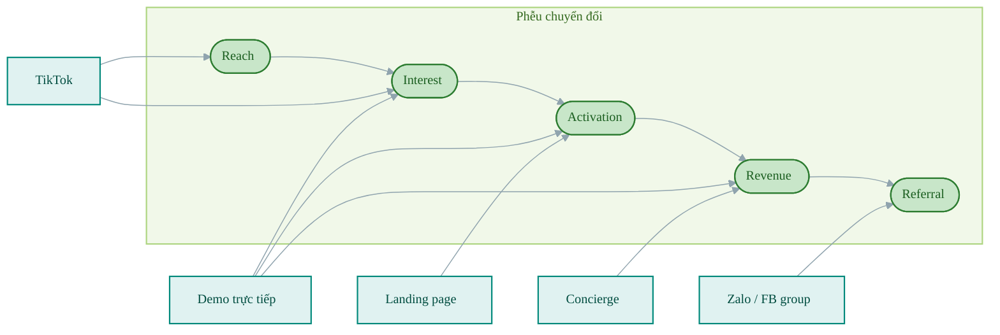
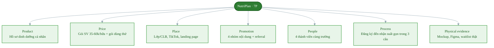

# Hạng mục 5: Kênh quảng bá dự kiến

**Người phụ trách:** Lê Phạm Kiều Duyên (Marketing và Growth Lead)
**Liên quan:** Hạng mục 5 trong `phan-cong-PA3.md`
**Kế thừa:** Hạng mục 2 (phân khúc ưu tiên), hạng mục 3 (chân dung), hạng mục 4 (thông điệp); khung kênh và 7P Tuần 4
**Hạn:** 12h trưa 17/7
**Trạng thái:** Hoàn thành

---

## Tóm tắt quyết định

Nhóm chốt kênh chính là demo trực tiếp tại lớp và câu lạc bộ trong cụm trường, kênh phụ là TikTok. Hai kênh này phục vụ hai tầng phễu khác nhau: demo trực tiếp gánh phần chuyển đổi vì tiếp cận đúng người và tạo được niềm tin ngay tại chỗ, TikTok gánh phần phủ sóng để kéo lượng người biết đến vượt khỏi số lớp mà nhóm đi được. Zalo và Facebook group môn học được dùng làm kênh hạ tầng để chăm sóc người đăng ký và đẩy giới thiệu, không tính là kênh thu hút. Nhóm chủ động không chạy quảng cáo trả phí trong giai đoạn này vì chưa có bằng chứng chuyển đổi để biết nên trả tiền cho thông điệp nào.

## 1. Bảng kênh khả thi

Mỗi kênh được chấm theo ba yếu tố quyết định của khung Tuần 4: khách có sẵn ở đó không, nguồn lực nhóm có kham nổi không, và có đo được chuyển đổi không. Thang Cao, Trung bình, Thấp.

| Kênh | Hành vi khách gắn với kênh | Khách có ở đó | Nhóm làm được | Đo lường được |
|---|---|---|---|---|
| Demo trực tiếp tại lớp và câu lạc bộ | S1 và S2 có mặt cố định theo lịch học, giờ nghỉ giữa buổi là lúc đúng bàn chuyện ăn trưa | Cao. Đúng cụm trường đã khoanh ở hạng mục 2 | Cao. Chỉ cần xin 5 phút đầu buổi, chi phí bằng không | Cao. Đếm được số người nghe, số người quét mã, số người điền form ngay tại chỗ |
| TikTok | Nhóm này lướt TikTok hằng ngày, nội dung ăn uống và sức khỏe là chủ đề họ chủ động xem | Cao | Trung bình. Dựng được video 20 đến 30 giây bằng Canva và điện thoại, nhưng lượt xem phụ thuộc thuật toán | Cao. Có sẵn số liệu lượt xem, lượt click vào link tiểu sử |
| Facebook group môn học và group ngành | Vào group để hỏi bài, mua bán đồ cũ, tìm phòng trọ; tin bài đăng của người cùng trường hơn quảng cáo | Cao | Cao. Thành viên nhóm đã ở sẵn trong các group này | Trung bình. Đếm được lượt tương tác, khó tách nguồn nếu không dùng link riêng |
| Zalo (nhóm lớp, tin nhắn cá nhân) | Kênh liên lạc mặc định với bạn cùng lớp và cùng phòng | Cao | Cao | Trung bình. Đo được số người nhận và số người phản hồi, không đo được lượt xem |
| Ký túc xá và phòng gym trường (poster, đứng bàn) | Đi qua mỗi ngày, đúng bối cảnh vừa tập xong hoặc vừa về phòng | Trung bình đến Cao | Trung bình. Cần xin phép ban quản lý, mất thời gian thủ tục | Thấp. Chỉ đo được qua mã QR riêng |
| Micro KOC sinh viên (tài khoản 3 đến 10 nghìn người theo dõi trong trường) | Theo dõi vì cùng trường, xem như bạn học chứ không phải người nổi tiếng | Cao | Trung bình. Cần thời gian tìm và thương lượng, khó hoàn tất gọn trong thời gian chiến dịch | Cao nếu dùng mã giới thiệu riêng |
| Quảng cáo trả phí (Facebook, TikTok Ads) | Khách có thấy nhưng ở trạng thái không chủ động tìm | Trung bình | Thấp. Cần ngân sách và thời gian tối ưu, nhóm không có cả hai | Cao |

Đọc bảng theo cột giữa thấy rõ ràng buộc thật của nhóm: ngân sách gần bằng không và thời gian chạy có hạn. Vì vậy tiêu chí nhóm làm được là tiêu chí loại, không phải tiêu chí cộng điểm. Quảng cáo trả phí và micro KOC rơi ra ở đúng cột này dù khách vẫn có ở đó.

## 2. Kênh chính và kênh phụ được chốt

### Kênh chính: demo trực tiếp tại lớp và câu lạc bộ

Lý do chọn:

- Đây là nơi khách hàng đã có sẵn niềm tin. Một lời giới thiệu từ bạn cùng lớp hoặc từ ban chủ nhiệm câu lạc bộ có sức nặng khác hẳn một quảng cáo lướt qua, đúng nguyên tắc chọn kênh theo niềm tin có sẵn của Tuần 4.
- Đúng đặc điểm tập trung theo cụm của phân khúc ưu tiên đã chốt ở hạng mục 2. Một buổi demo gặp được vài chục người đúng chân dung, tỷ lệ trúng đích cao hơn mọi kênh online.
- Cho phép trình bày bản Figma clickthrough và ảnh mockup trực tiếp, giải quyết được hạn chế bản web app chưa chạy. Người xem chạm được vào giao diện thay vì chỉ nghe mô tả.
- Thu được phản đối thật ngay tại chỗ. Đây là thứ không kênh online nào cho được và là đầu vào bắt buộc cho hạng mục 11.
- Chi phí bằng không, đo lường sạch nhất: số người nghe là mẫu số chính xác, không phải con số lượt xem ước lượng.

Hạn chế phải chấp nhận: quy mô tiếp cận bị chặn trên bởi số buổi demo nhóm xin được. Đây chính là lý do cần kênh phụ.

### Kênh phụ: TikTok

Lý do chọn:

- Bù đúng điểm yếu của kênh chính. TikTok không bị giới hạn bởi số lớp nhóm đi được, nên gánh phần mở rộng độ phủ để tổng reach đủ lớn cho bảng chỉ số ở hạng mục 9 có ý nghĩa.
- Định dạng video ngắn khớp với biến thể A ở hạng mục 4 (cảnh lướt app 15 phút rồi lại đặt món cũ, cắt sang suất NutriPlan tự đến). Đây là nội dung dựng được bằng điện thoại và Canva trong vài giờ.
- Là nơi kiểm chứng thông điệp với chi phí thấp nhất. Chạy đồng thời ba biến thể trên TikTok cho biết tiêu đề nào giữ chân người xem, kết quả này dùng lại được cho phần mở bán chính thức.

Hạn chế phải chấp nhận: lượt xem phụ thuộc thuật toán nên không dự đoán được, và người xem không nhất thiết ở TP.HCM. Vì vậy TikTok không được tính là kênh chuyển đổi, chỉ tính ở tầng Reach và Interest.

### Kênh hạ tầng: Zalo và Facebook group

Zalo và group môn học không được xếp là kênh thu hút mà là kênh giữ và lan. Vai trò cụ thể:

- Nhận người đăng ký beta từ hai kênh trên, gửi tin cảm ơn và bước tiếp theo (chi tiết ở hạng mục 8).
- Đẩy cơ chế giới thiệu, tận dụng mạng lưới xã hội chồng lấn của sinh viên cùng cụm trường đã phân tích ở hạng mục 2.
- Là nơi bằng chứng cộng đồng xuất hiện tự nhiên khi người dùng đầu tiên nói về sản phẩm.

### Kênh chủ động không chạy trong giai đoạn này

Quảng cáo trả phí bị loại có chủ đích, không phải vì thiếu tiền đơn thuần. Trả tiền để khuếch đại một thông điệp chưa được kiểm chứng là cách nhanh nhất để đốt ngân sách mà không học được gì. Điều kiện để mở kênh trả phí: đã có ít nhất một biến thể thông điệp cho tỷ lệ chuyển đổi vượt ngưỡng ở hạng mục 9, và bản web app đã chạy được để người click quảng cáo có thứ thật để dùng.

Micro KOC lùi lại giai đoạn sau vì thời gian tìm và thương lượng không khớp với một chiến dịch ngắn ngày, dù đây là kênh rất hợp khi mở rộng.

## 3. Kênh theo tầng phễu

Mỗi kênh gánh một vai trò khác nhau trong phễu, không kênh nào làm hết mọi việc.

| Tầng phễu | Kênh phụ trách chính | Hành động mong đợi của khách |
|---|---|---|
| Reach (biết đến) | TikTok, poster ký túc xá, bài đăng group | Xem hết video, dừng lại đọc |
| Interest (quan tâm) | TikTok, demo trực tiếp | Click vào link, quét mã QR, hỏi thêm sau buổi demo |
| Activation (đăng ký) | Demo trực tiếp, landing page | Điền form đăng ký beta |
| Revenue (trả tiền) | Demo trực tiếp, concierge thủ công | Đồng ý trả trước cho gói dùng thử |
| Referral (giới thiệu) | Zalo, Facebook group | Chia sẻ link cho bạn cùng lớp, cùng phòng |

Cách đọc bảng này: TikTok đưa người vào đầu phễu, demo trực tiếp chốt phần giữa và cuối, Zalo giữ vòng lặp quay lại. Bảng này là cơ sở để hạng mục 9 gán chỉ số cho từng kênh thay vì gộp chung một con số.

Sơ đồ kênh theo tầng phễu, thấy rõ mỗi kênh gánh vai trò gì, không kênh nào làm hết mọi việc:

## 4. Liên hệ 7P

- **Product.** Giá trị đầu tiên khách nhận được là hồ sơ dinh dưỡng cá nhân với con số calo và protein của riêng họ, đến trước cả bữa ăn. Ở kênh demo, đây chính là thứ nhóm đưa ra trước tiên vì nó tạo cảm giác cụ thể ngay trong 5 phút.
- **Price.** Gói tuần và gói tháng cho phân khúc sinh viên nằm trong khoảng 35 đến 60 nghìn một bữa đã chốt ở hạng mục 2. Gói dùng thử 1 đến 2 ngày là công cụ truyền thông quan trọng nhất về giá vì nó hạ rào cản cân nhắc kỹ trước khi trả cả gói, và là mức cam kết đo được trong chiến dịch.
- **Place.** Khách gặp NutriPlan ở ba nơi: trong lớp và câu lạc bộ (gặp trực tiếp), trên TikTok (gặp tình cờ), và trên landing page (nơi mọi kênh dẫn về). Landing page là điểm hội tụ duy nhất, mọi kênh chỉ có một đích đến, nhờ vậy phép đo không bị phân mảnh.
- **Promotion.** Bốn nhóm nội dung (giáo dục, bằng chứng, hậu trường, chuyển đổi) chi tiết ở hạng mục 8, cộng ưu đãi ra mắt và cơ chế giới thiệu ở hạng mục 6.
- **People.** Chính bốn thành viên nhóm là gương mặt của thương hiệu ở kênh demo. Việc người trình bày cũng là sinh viên cùng trường làm giảm rào cản niềm tin đáng kể so với một thương hiệu xa lạ.
- **Process.** Quy trình từ nghe demo đến nhận suất ăn phải nói được trong ba câu. Nếu người nghe không nhắc lại được quy trình sau buổi demo thì đó là lỗi truyền thông, không phải lỗi của họ.
- **Physical evidence.** Ảnh mockup ba màn cốt lõi, bản Figma clickthrough, và nếu chạy concierge thì suất ăn thật là bằng chứng mạnh nhất. Trên landing page, bằng chứng là câu nói thật của persona và con số waitlist cập nhật theo thời gian thực.

Sơ đồ 7P của NutriPlan trong một hình:

## 5. Góc tìm kiếm và cộng đồng

Sinh viên hiện tìm thông tin ở nhiều nơi ngoài Google: hỏi thẳng công cụ AI, hoặc gõ ngay vào ô tìm kiếm của TikTok. Nội dung muốn được tìm thấy phải trả lời đúng câu hỏi họ gõ, chứ không phải mô tả sản phẩm.

Các câu hỏi cụ thể nội dung nhóm nhắm trả lời:

- Sinh viên nên ăn bao nhiêu calo một ngày để tăng cơ.
- Ăn gì để đủ protein khi không có bếp nấu.
- Cơm văn phòng hay eat clean giao tận nơi ở TP.HCM giá bao nhiêu.
- Làm sao ăn đủ chất trong mùa thi khi không có thời gian.

Mỗi câu hỏi thành một video hoặc một bài đăng, trả lời thật trước rồi mới dẫn về NutriPlan ở cuối. Cách này phục vụ đồng thời nhóm nội dung giáo dục ở hạng mục 8 và khả năng được nhắc tới khi ai đó hỏi công cụ AI về ăn uống cho sinh viên tại TP.HCM.

Bằng chứng cộng đồng đưa lên landing page:

- Số người đã đăng ký waitlist, cập nhật liên tục, vì con số thật dù nhỏ vẫn đáng tin hơn lời hứa.
- Câu nói nguyên văn của người đăng ký về nỗi đau của họ, có xin phép trước khi đăng.
- Ảnh chụp buổi demo tại lớp, cho thấy có người thật đang quan tâm.
- Mục hỏi đáp gom đúng năm phản đối thu được trong chiến dịch, trả lời thẳng thay vì né.

Nguyên tắc bắt buộc: không tạo lời chứng thực giả, không đăng con số waitlist chưa đạt. Nếu chưa có bằng chứng thì để trống mục đó thay vì bịa, đúng nguyên tắc marketing có trách nhiệm mà nhóm cam kết.

## 6. Nhất quán với các hạng mục khác

- Hạng mục 2: kênh chính chọn được là nhờ đặc điểm tập trung theo cụm trường của phân khúc ưu tiên S1 và S2. Nếu chọn phân khúc nhân viên văn phòng thì kênh demo trực tiếp sẽ không khả thi, đây là hệ quả trực tiếp của quyết định phân khúc.
- Hạng mục 3: kênh chọn ở đây bám theo nơi persona thật sự tìm thông tin và người họ tin, không phải nơi nhóm thấy tiện.
- Hạng mục 4: ba biến thể thông điệp được phân bổ đúng kênh. Biến thể A chạy trên TikTok để kéo click, biến thể B và C dùng ở buổi demo và trên landing page để chốt.
- Hạng mục 6: cơ chế giới thiệu và growth loop vận hành trên kênh hạ tầng Zalo và Facebook group nêu ở mục 2.
- Hạng mục 8: bốn nhóm nội dung và landing page được dựng đúng theo phân vai kênh trong bảng phễu ở mục 3.
- Hạng mục 9: bảng chỉ số tách số liệu theo từng kênh dựa trên bảng phễu ở mục 3, nhờ vậy kết luận được kênh nào đáng tiếp tục thay vì chỉ có một con số tổng.

## 7. Tiêu chí hoàn thành (tự đối chiếu)

- [x] Có bảng kênh khả thi, mỗi kênh gắn với hành vi thật của khách và chấm đủ ba yếu tố.
- [x] Chốt rõ một kênh chính và một kênh phụ kèm lý do và hạn chế phải chấp nhận.
- [x] Có liên hệ đủ 7P, nêu bật Place và Promotion.
- [x] Có góc tìm kiếm mới và bằng chứng cộng đồng.
- [x] Nhất quán với kênh tìm thông tin ở hạng mục 3 và phân khúc ưu tiên ở hạng mục 2.
