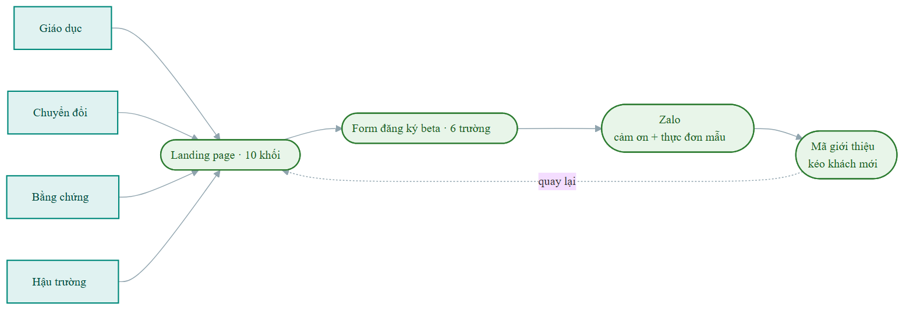
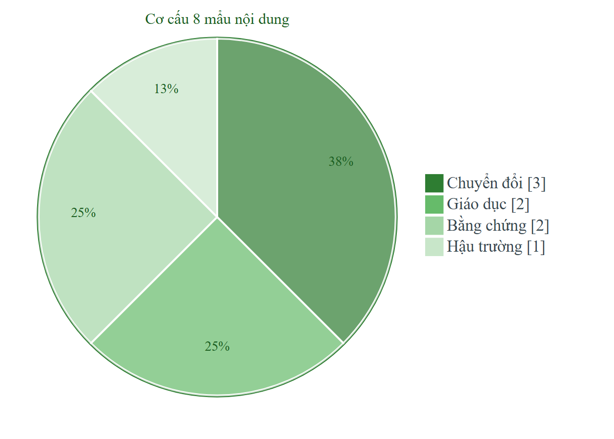

# Hạng mục 8: Hoạt động marketing giai đoạn đầu

**Người phụ trách:** Lê Phạm Kiều Duyên (Marketing và Growth Lead)
**Liên quan:** Hạng mục 8 trong `phan-cong-PA3.md`
**Kế thừa:** Hạng mục 4 (thông điệp), hạng mục 5 (kênh), hạng mục 6 (chiến lược khách hàng đầu tiên); khung content và landing page Tuần 4
**Hạn:** 23h tối 17/7
**Trạng thái:** Hoàn thành

---

## Tóm tắt quyết định

Phần này biến thông điệp và kênh đã chốt thành tài sản chạy được trong chiến dịch. Nhóm dựng một landing page duy nhất làm điểm hội tụ của mọi kênh, một form đăng ký beta chỉ sáu trường để không mất người giữa chừng, một lịch nội dung tám mẩu chia theo bốn nhóm giáo dục, bằng chứng, hậu trường, chuyển đổi, và một cơ chế giới thiệu bằng mã riêng để đo được nguồn khách. Nguyên tắc xuyên suốt: mỗi mẩu nội dung chỉ một lời kêu gọi hành động và phải gắn với đúng một chỉ số ở hạng mục 9, nếu không đo được thì không đăng.

## Sơ đồ hành trình và cơ cấu nội dung

Hành trình từ nội dung tới khách hàng và vòng giới thiệu quay lại:

<!-- Sơ đồ dựng từ assets/hm8-hanh-trinh-khach.mmd -->

Cơ cấu tám mẩu nội dung giai đoạn đầu, ưu tiên chuyển đổi và bằng chứng:

<!-- Sơ đồ dựng từ assets/hm8-co-cau-noi-dung.mmd -->

## 1. Lịch nội dung giai đoạn đầu

Tám mẩu nội dung, chia theo bốn nhóm của Tuần 4. Cột chỉ số đo là ràng buộc bắt buộc: mẩu nào không gán được chỉ số thì bị loại khỏi lịch.

| # | Nhóm nội dung | Nội dung cụ thể | Định dạng | Kênh | Lời kêu gọi hành động | Chỉ số đo |
|---|---|---|---|---|---|---|
| 1 | Giáo dục | Sinh viên nên ăn bao nhiêu calo một ngày để tăng cơ, cách tính nhanh theo cân nặng | Video 30 giây, có chữ trên màn hình | TikTok | Xem cách tính riêng cho bạn ở link tiểu sử | Lượt xem, lượt xem hết video, lượt click link |
| 2 | Giáo dục | Ăn gì để đủ protein khi ở trọ không có bếp, năm lựa chọn mua được quanh trường | Video 30 giây | TikTok | Nhận thực đơn mẫu theo mục tiêu | Lượt xem, lượt click link |
| 3 | Chuyển đổi | Biến thể A: Hết cảnh nghĩ trưa nay ăn gì. Cảnh lướt app 15 phút rồi lại đặt món cũ, cắt sang suất NutriPlan tự đến | Video 20 đến 30 giây | TikTok | Đăng ký dùng thử beta | Lượt xem, tỷ lệ click trên lượt xem |
| 4 | Chuyển đổi | Biến thể B: Đủ protein mỗi bữa để tập có kết quả. Bản cho S2: Đủ chất mỗi bữa để không tụt sức mùa thi | Ảnh mockup màn hồ sơ dinh dưỡng và thực đơn tuần, kèm caption | TikTok, Facebook group | Nhận thực đơn mẫu theo mục tiêu | Lượt tương tác, tỷ lệ đăng ký trên click |
| 5 | Chuyển đổi | Biến thể C: Biết trước tiền ăn cả tháng, không vượt ngân sách. Ảnh so sánh hóa đơn đặt lẻ rải rác và một gói gọn | Ảnh, kèm caption | Facebook group, Zalo | Xem bảng giá gói dùng thử | Lượt tương tác, lượt click |
| 6 | Bằng chứng | Ảnh chụp buổi demo tại lớp, kèm con số đã có bao nhiêu bạn đăng ký waitlist tính đến hôm nay | Ảnh, đăng dạng cập nhật | Facebook group, Zalo | Vào xem còn bao nhiêu suất ưu đãi | Lượt tương tác, lượt click |
| 7 | Bằng chứng | Câu nói nguyên văn của người đăng ký về nỗi đau của họ, có xin phép trước khi đăng | Ảnh chữ | TikTok, Facebook group | Đăng ký dùng thử beta | Lượt tương tác |
| 8 | Hậu trường | Nhóm bốn sinh viên đang xây NutriPlan, vì sao bắt đầu từ chính bữa ăn của mình | Video 45 giây | TikTok | Theo dõi để xem nhóm làm tiếp | Lượt xem, lượt theo dõi mới |

Cách phân bổ theo thời gian trong chiến dịch bảy ngày (gắn với kịch bản ở hạng mục 11):

- Mở màn (ngày 1): đăng mẩu 3, 4, 5 cùng lúc để phép so sánh A/B sạch, ba biến thể xuất phát cùng điều kiện.
- Phủ sóng và demo (ngày 2 đến 4): đăng mẩu 1, 2 để kéo thêm reach, đăng mẩu 6 và 7 sau buổi demo đầu tiên vì lúc đó mới có bằng chứng thật.
- Mẩu 8 đăng cuối, phục vụ giữ người theo dõi cho giai đoạn sau chứ không nhắm chuyển đổi trong chiến dịch.

Nhóm hậu trường chỉ có một mẩu vì trong một chiến dịch ngắn ngày, ưu tiên cao nhất là nội dung chuyển đổi và bằng chứng. Nội dung hậu trường có giá trị dài hạn cho việc xây niềm tin nhưng không tạo ra đăng ký ngay trong chiến dịch.

## 2. Đặc tả landing page

Một trang duy nhất, dựng bằng công cụ không cần lập trình (Canva Site hoặc Framer). Mọi kênh ở hạng mục 5 đều dẫn về đây, không có đích đến thứ hai.

| Khối | Nội dung |
|---|---|
| Tiêu đề | Hết cảnh nghĩ trưa nay ăn gì. |
| Phụ đề | Suất ăn đúng dinh dưỡng của riêng bạn, tự đến mỗi ngày. Bạn chỉ việc ăn. |
| Nút chính | Đăng ký dùng thử beta (dẫn thẳng xuống form) |
| Khối vấn đề | Ba dòng mô tả nỗi đau bằng ngôn ngữ persona: lướt app 15 phút rồi lại đặt đúng món hôm qua, tập mãi không lên vì ăn thất thường, mùa thi ăn cho có rồi tụt sức |
| Khối cách hoạt động | Ba bước: điền hồ sơ dinh dưỡng, nhận thực đơn tuần đã tính sẵn calo và protein, chọn gói và bữa tự đến mỗi ngày |
| Khối mockup | Ba ảnh giao diện: màn hồ sơ dinh dưỡng, màn thực đơn tuần, màn đặt gói. Ghi rõ dưới ảnh: đây là bản mô phỏng giao diện, sản phẩm đang trong giai đoạn phát triển |
| Khối bằng chứng | Con số waitlist cập nhật liên tục, câu nói thật của người đăng ký, ảnh buổi demo tại lớp |
| Khối giá | Khoảng giá gói cho sinh viên và gói dùng thử 1 đến 2 ngày, nêu rõ đây là giá dự kiến giai đoạn beta |
| Khối hỏi đáp | Năm câu, lấy đúng từ phản đối thu được trong buổi demo và cập nhật liên tục trong chiến dịch |
| Nút cuối trang | Lặp lại đúng nút chính, không thêm nút mới |

Nguyên tắc thiết kế:

- Chỉ một lời kêu gọi hành động trên toàn trang, lặp lại ở đầu và cuối. Không đặt thêm nút tải app, xem thêm hay liên hệ tư vấn vì mỗi nút thêm vào là một cách để người dùng rời đi mà không để lại thông tin.
- Ba biến thể thông điệp dùng chung trang này, chỉ khác khối tiêu đề và phụ đề. Nhờ vậy chênh lệch về tỷ lệ đăng ký giữa ba biến thể quy hết về sức mạnh thông điệp, không lẫn với khác biệt thiết kế.
- Ghi rõ trạng thái mô phỏng ở khối mockup và trạng thái dự kiến ở khối giá. Đây là yêu cầu bắt buộc của nguyên tắc marketing có trách nhiệm, và cũng tránh việc người đăng ký thất vọng khi biết sản phẩm chưa chạy.

## 3. Form đăng ký beta

Sáu trường, tối đa một phút để điền. Mỗi trường phải trả lời được câu hỏi vì sao cần, nếu không thì bỏ.

| Trường | Bắt buộc | Vì sao cần |
|---|---|---|
| Tên hoặc biệt danh | Có | Để xưng hô khi liên hệ lại |
| Zalo hoặc email | Có | Kênh liên hệ duy nhất, cũng là mức cam kết nhẹ phản ánh nhu cầu thật |
| Trường hoặc nơi làm việc | Có | Xác nhận có nằm trong cụm trường đã khoanh ở hạng mục 2, phục vụ tính SOM ở hạng mục 1 |
| Mục tiêu sức khỏe (tăng cơ, giảm cân, giữ sức, chưa rõ) | Có | Phân người đăng ký về nhóm S1 hoặc S2, kiểm chứng dự đoán biến thể thắng ở hạng mục 4 |
| Mức giá một bữa bạn thấy hợp lý (dưới 35, 35 đến 50, 50 đến 65, trên 65 nghìn) | Có | Kiểm chứng khoảng giá đã giả định ở hạng mục 2 bằng số liệu thật |
| Bạn biết NutriPlan từ đâu (demo tại lớp, TikTok, bạn giới thiệu, khác) | Có | Tách nguồn khách theo kênh, là đầu vào bắt buộc cho bảng chỉ số ở hạng mục 9 |

Trường tùy chọn duy nhất: một ô mở hỏi điều gì khiến bạn còn lưỡng lự. Ô này là nguồn thu phản đối ngoài buổi demo, bổ sung cho danh sách năm phản đối ở hạng mục 11.

Các trường đã cân nhắc rồi bỏ: giới tính, tuổi, chiều cao cân nặng, khung giờ ăn quen thuộc. Đây đều là thông tin cần cho sản phẩm nhưng không cần cho việc đo nhu cầu, và mỗi trường thêm vào làm tăng tỷ lệ bỏ dở giữa chừng. Những thông tin này thu sau, khi mời người dùng vào bản chạy thật.

## 4. Kênh liên hệ người đăng ký và tin nhắn mẫu

Kênh chính là Zalo, dự phòng là email cho người không để lại Zalo. Chọn Zalo vì đây là kênh liên lạc mặc định của phân khúc sinh viên, tỷ lệ đọc cao hơn hẳn email và cho phép trả lời qua lại ngay.

Quy trình sau khi có người đăng ký:

1. Trong vòng hai giờ, nhắn tin cảm ơn kèm bước tiếp theo. Tốc độ phản hồi ở giai đoạn này là bằng chứng về chất lượng dịch vụ, và người vừa đăng ký là người đang quan tâm nhất.
2. Gửi kèm thực đơn mẫu theo đúng mục tiêu sức khỏe họ chọn trong form. Đây là giá trị thật trao ngay, không chờ sản phẩm hoàn thiện.
3. Hỏi một câu mở để thu insight và mở đường cho concierge.
4. Gửi mã giới thiệu riêng.

Tin nhắn mẫu:

> Chào [tên], NutriPlan đây. Cảm ơn bạn đã đăng ký dùng thử beta.
>
> Gửi bạn thực đơn mẫu 3 ngày cho mục tiêu [mục tiêu bạn chọn], đã tính sẵn calo và protein từng bữa: [link]
>
> Bọn mình đang hoàn thiện bản chạy thật và sẽ mời nhóm đăng ký sớm vào dùng đầu tiên, có ưu đãi riêng cho nhóm này.
>
> Cho mình hỏi nhanh một câu: hiện tại bữa ăn trong ngày của bạn đang vướng nhất ở chỗ nào?
>
> Nếu bạn thấy hữu ích, gửi mã [mã riêng] cho bạn bè để cả hai cùng được ưu đãi khi mở bán.

Nguyên tắc: không nhắn hàng loạt bằng tin sao chép nguyên si, luôn điền đúng tên và mục tiêu của từng người. Với mẫu vài chục người trong chiến dịch, việc này làm thủ công được và tạo khác biệt rõ về tỷ lệ phản hồi.

Về dữ liệu cá nhân: chỉ dùng thông tin liên hệ cho mục đích mời dùng thử NutriPlan, không chia sẻ cho bên thứ ba, và ghi rõ điều này ngay dưới form đăng ký. Người đăng ký có thể yêu cầu xóa thông tin bất cứ lúc nào.

## 5. Cơ chế giới thiệu

Mỗi người đăng ký nhận một mã riêng dạng `NP-[tên viết tắt][số]`, ví dụ `NP-HUY07`. Mã này gửi kèm trong tin nhắn cảm ơn ở mục 4.

Cách vận hành trong chiến dịch:

- Người được giới thiệu điền mã vào ô bạn biết NutriPlan từ đâu khi chọn mục bạn giới thiệu.
- Nhóm đối chiếu thủ công trên bảng tính, đếm được mỗi người đăng ký kéo thêm bao nhiêu người.
- Ưu đãi hai chiều: cả người giới thiệu và người được giới thiệu đều được ưu đãi khi mở bán chính thức. Ưu đãi hai chiều quan trọng vì nó cho người giới thiệu một lý do chính đáng để nhắn cho bạn mình, thay vì cảm giác đang đi bán hàng.

Vì sao dùng mã thủ công thay vì link theo dõi tự động: trong một chiến dịch nhỏ với mẫu vài chục người, bảng tính thủ công đủ chính xác và dựng xong trong 15 phút, còn hệ thống link tự động tốn nhiều thời gian hơn phần giá trị nó mang lại. Khi quy mô vượt vài trăm người thì mới cần chuyển sang link riêng.

Chỉ số thu được từ cơ chế này nạp thẳng vào tầng Referral của bảng chỉ số ở hạng mục 9. Chi tiết growth loop và ưu đãi ra mắt thuộc hạng mục 6 do Phúc phụ trách, phần này chỉ chịu trách nhiệm phần kỹ thuật đo lường nguồn khách.

## 6. Danh mục tài sản cần chuẩn bị khi triển khai

- [ ] Landing page một trang, đủ mười khối ở mục 2, có link truy cập được
- [ ] Ba biến thể tiêu đề và phụ đề cho landing page (A, B, C)
- [ ] Form đăng ký beta sáu trường, đã chạy thử điền thật một lần
- [ ] Ba ảnh mockup: hồ sơ dinh dưỡng, thực đơn tuần, đặt gói
- [ ] Bản Figma clickthrough ba màn cho buổi demo
- [ ] Ba mẩu nội dung chuyển đổi (mẩu 3, 4, 5) đã dựng xong và hẹn giờ đăng
- [ ] Thực đơn mẫu 3 ngày cho từng mục tiêu (tăng cơ, giảm cân, giữ sức)
- [ ] Bảng tính theo dõi người đăng ký và mã giới thiệu
- [ ] Tin nhắn mẫu đã soạn sẵn

## 7. Nhất quán với các hạng mục khác

- Hạng mục 4: ba mẩu nội dung chuyển đổi (3, 4, 5) chính là ba biến thể thông điệp, giữ nguyên tiêu đề, phụ đề, lời kêu gọi hành động và hình minh họa đã chốt.
- Hạng mục 5: mỗi mẩu nội dung được gán đúng kênh theo bảng phễu, nội dung chuyển đổi ưu tiên TikTok cho biến thể A và group cho biến thể B, C.
- Hạng mục 6: mã giới thiệu ở mục 5 là phần đo lường của growth loop do Phúc thiết kế, ưu đãi ra mắt lấy theo mức Phúc chốt.
- Hạng mục 7: landing page và form là điều kiện sẵn sàng bắt buộc trong timeline ra mắt mềm của Dũng.
- Hạng mục 9: trường bạn biết NutriPlan từ đâu trong form và mã giới thiệu là hai cơ chế duy nhất cho phép tách số liệu theo kênh, không có chúng thì bảng chỉ số chỉ có con số tổng.
- Hạng mục 11: ô hỏi điều gì khiến bạn còn lưỡng lự trong form bổ sung cho danh sách phản đối thu được tại buổi demo.

## 8. Tiêu chí hoàn thành (tự đối chiếu)

- [x] Có lịch nội dung đủ bốn nhóm, mỗi mẩu gắn kênh, lời kêu gọi hành động và chỉ số đo.
- [x] Có đặc tả landing page đầy đủ theo checklist Tuần 4, chỉ một lời kêu gọi hành động.
- [x] Có đặc tả form đăng ký beta với lý do cho từng trường và các trường đã chủ động loại bỏ.
- [x] Có kênh liên hệ người đăng ký kèm quy trình và tin nhắn mẫu.
- [x] Có cơ chế giới thiệu đo được nguồn khách.
- [ ] Landing page và form đã dựng thật khi triển khai chiến dịch (ngoài phạm vi bản kế hoạch này).
