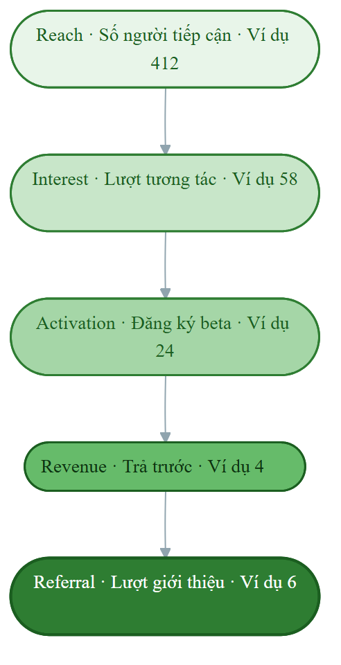
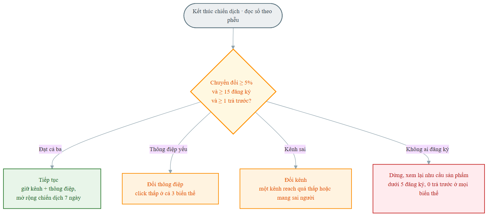

# Hạng mục 9: Chỉ số đo lường hiệu quả

**Người phụ trách:** Lê Phạm Kiều Duyên và Dương Minh Dũng
**Liên quan:** Hạng mục 9 trong `phan-cong-PA3.md`
**Kế thừa:** Hạng mục 5 (kênh), hạng mục 7 (kế hoạch ra mắt), hạng mục 8 (hoạt động marketing); khung funnel và thí nghiệm Tuần 4
**Hạn:** Khung bảng chỉ số 23h tối 17/7
**Trạng thái:** Hoàn thành phần khung kế hoạch đo lường

---

PA3 là bản kế hoạch quảng bá, nhóm chưa chạy chiến dịch thật nên phần này chưa có số liệu kết quả. Mục tiêu của hạng mục là chỉ ra rõ: nhóm sẽ đo hiệu quả marketing bằng những chỉ số nào, tính theo công thức nào, đặt mục tiêu bao nhiêu là đạt, và quan trọng nhất là nhìn thấy từng con số đó ở đâu, qua công cụ nào. Khi chạy chiến dịch ở giai đoạn sau, chỉ việc ghi số thu được vào đúng khung này. Việc chốt trước bộ chỉ số và ngưỡng quyết định là để tránh tình trạng chạy xong mới đi tìm cách giải thích kết quả.

*Các con số ở cột Ví dụ minh họa trong tài liệu này là số giả định, dùng để cho thấy bảng chỉ số trông thế nào khi điền và cách đọc ra kết luận. Đây chưa phải số đo thật, sẽ được thay bằng số liệu thu được khi chạy chiến dịch.*

## Tóm tắt quyết định

Nhóm đo theo phễu năm tầng Reach, Interest, Activation, Revenue, Referral, mỗi tầng một chỉ số chính và một công thức rõ ràng. Chỉ số quan trọng nhất là tỷ lệ đăng ký beta trên số người tiếp cận, vì đây là thứ phản ánh sức mạnh thông điệp chứ không phản ánh may mắn thuật toán. Mỗi chỉ số được gắn với một nguồn dữ liệu cụ thể để biết nhìn con số đó ở đâu: bảng đếm tay tại buổi demo, thống kê sẵn có của TikTok và Facebook, và kết quả tổng hợp từ Google Form. Số liệu tách theo hai kênh chính là demo trực tiếp và TikTok, và tách theo ba biến thể thông điệp, nhờ vậy khi có kết quả sẽ kết luận được ở mức kênh nào và thông điệp nào chứ không dừng ở một con số tổng.

> **North Star Metric: Tỷ lệ đăng ký beta trên số người tiếp cận.** Đây là con số nhóm tối ưu xuyên suốt chiến dịch, vì nó phản ánh sức mạnh thông điệp rõ nhất và không bị nhiễu bởi may mắn thuật toán. Mọi chỉ số khác trong phần này là chỉ số hỗ trợ để giải thích North Star tăng hay giảm.

Sơ đồ phễu năm tầng, kèm số ví dụ minh họa để thấy độ rơi giữa các tầng:

<!-- Sơ đồ dựng từ assets/hm9-pheu-5-tang.mmd -->

## 1. Bảng chỉ số theo phễu

Mục tiêu đặt cho quy mô một chiến dịch nhỏ chạy trên kênh tự nhiên, không phải cho một chiến dịch có ngân sách quảng cáo. Cột cuối cho biết nhìn thấy con số ở đâu, đây là phần trả lời câu hỏi đo bằng cách nào.

| Tầng phễu | Chỉ số | Công thức | Mục tiêu định hướng | Ví dụ minh họa | Nhìn thấy ở đâu |
|---|---|---|---|---|---|
| Reach | Số người tiếp cận | Số người nghe demo cộng lượt xem TikTok cộng lượt tiếp cận bài đăng group | Vài trăm người | 412 | Đếm tay tại buổi demo; mục thống kê lượt xem của TikTok; mục insight của bài đăng Facebook group |
| Interest | Lượt tương tác | Lượt click link, lượt quét mã QR, lượt bình luận và lưu bài | Khoảng 15 phần trăm reach | 58 | Thống kê click ở link tiểu sử TikTok; số lượt quét mã QR; đếm bình luận và lượt lưu trên bài đăng |
| Activation | Lượt đăng ký beta | Số form đăng ký hợp lệ (có liên hệ, thuộc cụm trường mục tiêu) | Vài chục đăng ký | 24 | Bảng tổng hợp câu trả lời của Google Form |
| Revenue | Số người đồng ý trả trước | Số người nhận gói dùng thử concierge và trả tiền hoặc cam kết trả | Một vài người đầu tiên | 4 | Ghi tay danh sách người đã chuyển tiền hoặc chốt lịch nhận suất ăn |
| Referral | Số lượt giới thiệu | Số người đăng ký có điền mã giới thiệu của người khác | Một vài lượt | 6 | Trường mã giới thiệu trong Google Form, đối chiếu trên bảng tính |

Ghi chú cách đếm để tránh thổi phồng số khi chạy thật:

- Reach tính theo người, không theo lượt. Một người vừa nghe demo vừa xem TikTok chỉ tính một lần, đối chiếu bằng trường bạn biết NutriPlan từ đâu trong form.
- Đăng ký hợp lệ loại bỏ các bản điền thử của chính thành viên nhóm và các bản trùng thông tin liên hệ.
- Cam kết trả trước chỉ tính khi người đó đã chuyển tiền hoặc chốt lịch nhận suất ăn cụ thể. Câu trả lời dạng chắc mình sẽ mua không được tính vào tầng Revenue vì đây là loại xác nhận rẻ tiền nhất và cũng ít đúng nhất.

## 2. Chỉ số tổng hợp

Đây là các tỷ lệ tính ra từ bảng phễu, phản ánh chất lượng chứ không chỉ số lượng.

| Chỉ số | Công thức | Mục tiêu định hướng | Ví dụ minh họa | Nhìn thấy ở đâu |
|---|---|---|---|---|
| Tỷ lệ chuyển đổi tổng | Lượt đăng ký chia số người tiếp cận | Khoảng 5 đến 7 phần trăm | 5,8 phần trăm (24 trên 412) | Tính từ tầng Activation và Reach |
| Tỷ lệ click trên reach | Lượt tương tác chia số người tiếp cận | Khoảng 15 phần trăm | 14,1 phần trăm | Tính từ tầng Interest và Reach |
| Tỷ lệ đăng ký trên click | Lượt đăng ký chia lượt tương tác | Khoảng 40 phần trăm trở lên | 41,4 phần trăm | Tính từ tầng Activation và Interest |
| Chi phí có một đăng ký | Tổng chi phí quy đổi chia số đăng ký | Càng thấp càng tốt, kênh tự nhiên gần bằng không tiền mặt | 25 nghìn đồng | Tính từ bảng công sức và tầng Activation |
| Tỷ lệ trả trước trên đăng ký | Số người trả trước chia số đăng ký | Một phần nhỏ đủ để chứng minh có nhu cầu trả tiền | 16,7 phần trăm | Tính từ tầng Revenue và Activation |

Cách quy đổi chi phí khi chạy kênh tự nhiên: chi phí tiền mặt gần bằng không (chỉ có phí công cụ dựng landing page và chi phí nguyên liệu nếu chạy concierge), nên phần lớn chi phí là công sức. Nhóm quy đổi theo công thức số giờ làm nhân mức thù lao làm thêm phổ biến của sinh viên tại TP.HCM, khoảng 25 nghìn đồng một giờ. Cách quy đổi này không phải chi phí thật đã chi mà là chi phí cơ hội, nêu rõ giả định để người đọc PA4 hiểu đúng bản chất con số.

Ví dụ minh họa cách tính: 20 giờ công nhân 25 nghìn bằng 500 nghìn, cộng 100 nghìn phí công cụ và nguyên liệu, chia cho 24 đăng ký, ra khoảng 25 nghìn đồng một đăng ký.

## 3. Tách chỉ số theo kênh

Đây là lý do trường bạn biết NutriPlan từ đâu trong form ở hạng mục 8 tồn tại. Không có nó thì mọi kết luận về kênh chỉ là phỏng đoán. Khi chạy thật, mỗi kênh được điền reach và số đăng ký riêng để tính ra tỷ lệ chuyển đổi của từng kênh.

| Kênh | Đo reach ở đâu | Đo đăng ký ở đâu | Reach (ví dụ) | Đăng ký (ví dụ) | Tỷ lệ chuyển đổi (ví dụ) |
|---|---|---|---|---|---|
| Demo trực tiếp tại lớp và câu lạc bộ | Đếm tay số người nghe | Trường nguồn trong form chọn demo tại lớp | 87 | 15 | 17,2 phần trăm |
| TikTok | Thống kê lượt xem của TikTok | Trường nguồn trong form chọn TikTok | 268 | 5 | 1,9 phần trăm |
| Facebook group và Zalo | Insight bài đăng, số thành viên nhóm | Trường nguồn trong form chọn bạn giới thiệu hoặc khác | 57 | 4 | 7,0 phần trăm |

Cách đọc bảng này khi có số thật: kỳ vọng TikTok cho reach lớn nhất nhưng tỷ lệ chuyển đổi thấp, demo trực tiếp ngược lại, đúng với phân vai đã đặt ở hạng mục 5. Dạng số ví dụ ở trên minh họa đúng kỳ vọng này. Nếu số thật cho thấy demo trực tiếp lại không có tỷ lệ chuyển đổi cao hơn TikTok đáng kể thì giả định về sức mạnh của kênh gặp mặt bị bác bỏ, và cần xem lại phần trình bày trong buổi demo chứ không phải đổi kênh.

## 4. Tách chỉ số theo biến thể thông điệp

Ba biến thể ở hạng mục 4 chạy đồng thời trên cùng landing page, chỉ khác tiêu đề và phụ đề, nên chênh lệch kết quả quy về sức mạnh thông điệp. Mỗi biến thể được đo riêng theo hai tầng để kiểm chứng dự đoán ở hạng mục 4.

| Biến thể | Hướng lợi ích | Click / reach (ví dụ) | Đăng ký / click (ví dụ) | Dự đoán ở hạng mục 4 |
|---|---|---|---|---|
| A | Tiết kiệm thời gian | 16,7 phần trăm (cao nhất) | 29,0 phần trăm | Thắng ở tầng thu hút, tỷ lệ click cao nhất |
| B | Đạt mục tiêu sức khỏe | 13,4 phần trăm | 61,1 phần trăm (cao nhất) | Thắng ở tầng chuyển đổi, tỷ lệ đăng ký trên click cao nhất |
| C | Kiểm soát chi phí | 9,8 phần trăm | 44,4 phần trăm | Là bước chốt cho nhóm nhạy giá, không phải nội dung mở đầu |

Mỗi biến thể được đo tỷ lệ click từ thống kê video và bài đăng riêng, đo tỷ lệ đăng ký từ trang landing dùng đúng tiêu đề của biến thể đó. Dạng số ví dụ ở trên khớp với dự đoán ở hạng mục 4: A cao nhất ở tầng thu hút, B cao nhất ở tầng chuyển đổi.

Lưu ý khi có số thật: với mẫu vài chục người, chênh lệch nhỏ giữa các biến thể chưa đủ để kết luận chắc chắn. Chỉ coi là có ý nghĩa khi chênh lệch đủ lớn, ví dụ tỷ lệ của biến thể này gấp rưỡi biến thể kia trở lên. Nếu ba biến thể cho kết quả sát nhau thì kết luận trung thực là chưa phân định được, cần thêm mẫu, chứ không phải chọn đại biến thể nhỉnh hơn vài phần trăm.

## 5. Chỉ số định tính

Số liệu định lượng ở trên nói được cái gì đang xảy ra nhưng không nói được vì sao. Bốn chỉ số định tính bổ sung phần vì sao.

| Chỉ số | Cách thu | Mục tiêu |
|---|---|---|
| Số phản đối thật ghi nhận được | Ghi lại nguyên văn tại buổi demo và từ ô mở trong form | Ít nhất 5 phản đối khác nhau |
| Câu nói mô tả nỗi đau bằng ngôn ngữ khách | Ghi lại nguyên văn khi khách tự mô tả vấn đề của họ | Ít nhất 5 câu, dùng lại cho nội dung |
| Phân bố mục tiêu sức khỏe của người đăng ký | Thống kê trường mục tiêu trong form | Kiểm chứng tỷ lệ S1 và S2 giả định ở hạng mục 2 |
| Phân bố mức giá chấp nhận | Thống kê trường mức giá trong form | Kiểm chứng khoảng 35 đến 60 nghìn một bữa giả định ở hạng mục 2 |

Hai chỉ số cuối đáng chú ý vì chúng kiểm chứng ngược lại giả định của hạng mục 2. Nếu phần lớn người đăng ký chọn mức dưới 35 nghìn thì khoảng giá đã giả định là quá cao và ảnh hưởng thẳng tới mô hình doanh thu ở PA4, không chỉ ảnh hưởng tới thông điệp.

## 6. Ngưỡng quyết định

Các ngưỡng dưới đây được chốt trong bản kế hoạch, trước khi chạy và trước khi có bất kỳ số liệu nào. Đây là điều kiện bắt buộc để bảng chỉ số có giá trị, vì ngưỡng đặt sau khi biết kết quả thì luôn luôn được đáp ứng và không nói lên điều gì.

**Tiếp tục nếu:**

- Tỷ lệ chuyển đổi tổng đạt từ 5 phần trăm trở lên, và
- Có ít nhất 15 đăng ký hợp lệ, và
- Có ít nhất 1 người đồng ý trả trước.

Khi đủ ba điều kiện, kết luận là nhu cầu có thật ở mức đủ để tiếp tục, giữ nguyên kênh và thông điệp, mở rộng quy mô sang chiến dịch bảy ngày đầy đủ ở hạng mục 7 khi bản web app sẵn sàng.

**Đổi thông điệp nếu:**

- Tỷ lệ click trên reach dưới 8 phần trăm ở cả ba biến thể. Người ta thấy nội dung nhưng không đủ quan tâm để bấm, vấn đề nằm ở tiêu đề chứ không ở kênh.
- Hoặc tỷ lệ đăng ký trên click dưới 20 phần trăm dù tỷ lệ click cao. Người ta bấm vào rồi bỏ đi, vấn đề nằm ở landing page hoặc ở khoảng cách giữa lời hứa trong tiêu đề và thứ họ thấy khi vào trang.

**Đổi kênh nếu:**

- Một kênh cho reach dưới 50 người sau khi đã đăng đủ số nội dung đã lên lịch. Kênh đó không tiếp cận được khách trong điều kiện của nhóm.
- Hoặc một kênh cho tỷ lệ chuyển đổi dưới 1 phần trăm dù reach lớn. Kênh mang về sai người, không phải mang về ít người.

**Dừng lại xem xét lại sản phẩm nếu:**

- Dưới 5 đăng ký hợp lệ và không ai đồng ý trả trước, ở cả hai kênh, với cả ba biến thể thông điệp. Khi cả ba biến số đều đã thay đổi mà kết quả vẫn bằng không thì vấn đề nhiều khả năng nằm ở giả định về nhu cầu chứ không nằm ở cách quảng bá. Đây là kết quả không ai muốn nhưng là kết quả đáng giá nhất nếu xảy ra, vì nó tiết kiệm được nhiều tháng xây sản phẩm sai hướng.

Sơ đồ cây quyết định, chốt trước khi chạy để không nhìn kết quả rồi mới đặt chuẩn:

<!-- Sơ đồ dựng từ assets/hm9-cay-quyet-dinh.mmd -->

## 7. Cách rút kết luận khi có số liệu

Phần này mô tả cách đọc kết quả, sẽ được điền số và viết thành kết luận thật sau khi chạy chiến dịch. Trình tự đọc gồm bốn bước:

1. So bảng phễu ở mục 1 với ba điều kiện tiếp tục ở mục 6, xác định rơi vào tình huống nào trong bốn tình huống ngưỡng quyết định.
2. Đọc bảng tách theo kênh ở mục 3 để biết giữ hay đổi phân vai kênh đã đặt ở hạng mục 5.
3. Đọc bảng tách theo biến thể ở mục 4 để chốt thông điệp nào làm đầu phễu, thông điệp nào làm nội dung chốt, đối chiếu với dự đoán ở hạng mục 4.
4. Ghi lại rõ điểm nào số thật khác với dự đoán ban đầu. Chỗ số thật lệch khỏi dự đoán là chỗ có giá trị nhất, không phải chỗ cần giấu đi.

Hai con số dùng lại trực tiếp cho PA4 là chi phí có một đăng ký và tỷ lệ trả trước trên đăng ký. Vì vậy khi có kết quả, hai chỉ số này cần được ghi cẩn thận nhất.

Ví dụ minh họa cách rút kết luận, đọc theo dạng số giả định ở các bảng trên: tỷ lệ chuyển đổi tổng 5,8 phần trăm vượt ngưỡng 5 phần trăm, 24 đăng ký vượt mức 15, có 4 người đồng ý trả trước, nên rơi vào tình huống tiếp tục. Kết luận tương ứng gồm ba ý: giữ nguyên phân vai kênh (demo trực tiếp là kênh chuyển đổi với 17,2 phần trăm, TikTok là kênh phủ sóng với 1,9 phần trăm nhưng đóng góp phần lớn reach); dùng biến thể A làm nội dung đầu phễu và biến thể B làm nội dung chốt đúng như dự đoán; lấy mức 25 nghìn đồng một đăng ký làm con số nền để so sánh khi mở kênh trả phí sau này. Khi có số thật, thay toàn bộ số trên bằng số đo được và viết lại kết luận theo đúng số đó.

## 8. Nhất quán với các hạng mục khác

- Hạng mục 2: hai chỉ số định tính về mục tiêu sức khỏe và mức giá chấp nhận kiểm chứng ngược lại giả định phân khúc, kết quả ảnh hưởng tới cả PA4.
- Hạng mục 4: bảng ở mục 4 là phép kiểm chứng trực tiếp cho dự đoán biến thể thắng, đo theo đúng hai tầng đã nêu là click trên reach và đăng ký trên click.
- Hạng mục 5: bảng ở mục 3 tách chỉ số theo đúng phân vai kênh trong bảng phễu đã chốt.
- Hạng mục 8: trường bạn biết NutriPlan từ đâu và mã giới thiệu là hai cơ chế thu dữ liệu cho mục 3 và tầng Referral.
- Hạng mục 11: khi chạy chiến dịch thật, số liệu thu được điền vào khung này và dùng lại nguyên vẹn trong báo cáo chiến dịch, không tính lại theo cách khác để tránh mâu thuẫn giữa hai tài liệu.
- PA4: chỉ số chi phí có một đăng ký và tỷ lệ trả trước là hai con số dùng trực tiếp cho phần dự phóng chi phí thu hút khách hàng.

## 9. Tiêu chí hoàn thành (tự đối chiếu)

- [x] Có bảng chỉ số đủ năm tầng phễu, mỗi chỉ số có công thức và mục tiêu định hướng.
- [x] Mỗi chỉ số gắn với nguồn dữ liệu cụ thể, trả lời được câu hỏi nhìn thấy con số ở đâu.
- [x] Có ngưỡng quyết định đặt trước khi chạy, đủ bốn tình huống tiếp tục, đổi thông điệp, đổi kênh, dừng xem xét lại.
- [x] Có cách tách chỉ số theo kênh và theo biến thể thông điệp.
- [x] Có chỉ số định tính bổ sung phần vì sao.
- [x] Có công thức quy đổi chi phí cho kênh tự nhiên kèm giả định nêu rõ.
- [x] Có quy trình rút kết luận và ví dụ minh họa cách đọc số, để áp dụng khi chạy chiến dịch thật.
- [ ] Đã thay số ví dụ minh họa bằng số liệu thật sau khi chạy chiến dịch.
