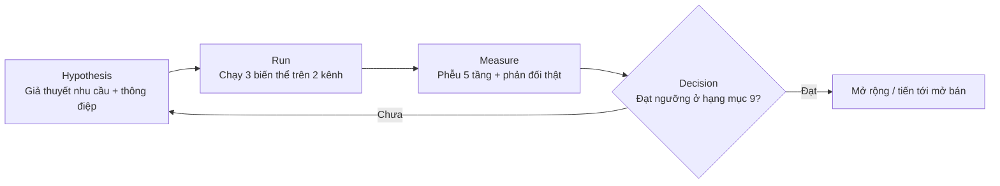
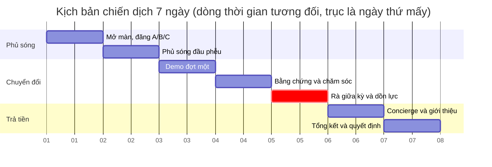

# Hạng mục 11: Kịch bản chiến dịch kiểm chứng nhu cầu 7 ngày

**Người phụ trách:** Lê Phạm Kiều Duyên và Nguyễn Trọng Phúc
**Liên quan:** Hạng mục 11 trong `phan-cong-PA3.md`
**Kế thừa:** Hạng mục 4, 5, 8, 9 (thông điệp, kênh, hoạt động, chỉ số)
**Hạn:** Hoàn thành phần kịch bản trong bản kế hoạch PA3
**Trạng thái:** Hoàn thành phần thiết kế; phần chạy thật để lại giai đoạn sau

---

PA3 là bản kế hoạch, nhóm chưa chạy chiến dịch thật. Hạng mục này trình bày kịch bản đầy đủ để chạy một chiến dịch kiểm chứng nhu cầu trong 7 ngày: chạy cái gì, ngày nào, ai làm, đo bằng chỉ số nào, và tới ngưỡng nào thì quyết định tiếp tục hay đổi hướng. Toàn bộ dùng công cụ không cần lập trình và kênh tự nhiên, ngân sách gần bằng không. Khi bản web app sẵn sàng và nhóm có đủ thời gian, chỉ việc chạy theo kịch bản này rồi điền số liệu thật vào các bảng để trống, và tài liệu này trở thành báo cáo chiến dịch thật.

Các bảng số liệu và danh sách phản đối bên dưới là khung để điền khi chạy, không phải kết quả đã đo. Phần phản đối được chuẩn bị trước từ các rào cản mua đã biết ở PA2, đây là giả định cần kiểm chứng chứ không phải lời khách hàng thật đã thu.

## 1. Thiết kế thí nghiệm (chốt trước khi chạy)

- **Giả thuyết chính.** Sinh viên sống xa nhà quanh một cụm trường tại TP.HCM có nhu cầu thật với dịch vụ suất ăn healthy theo gói, đủ mạnh để để lại thông tin và một phần đồng ý trả trước sau khi nghe thông điệp, dù sản phẩm chưa hoàn thiện.
- **Giả thuyết phụ về thông điệp.** Biến thể A (tiết kiệm thời gian) kéo click cao nhất ở đầu phễu; biến thể B (mục tiêu sức khỏe) cho tỷ lệ đăng ký trên click cao nhất. Chi tiết ở hạng mục 4.
- **Giả thuyết phụ về kênh.** Demo trực tiếp cho tỷ lệ chuyển đổi cao nhất; TikTok cho reach lớn nhất nhưng chuyển đổi thấp. Chi tiết ở hạng mục 5.
- **Phân khúc nhắm tới.** Hai nhóm hành vi S1 và S2 trong cùng cụm trường, theo hạng mục 2.
- **Tài sản dùng.** Landing page một trang, form đăng ký beta sáu trường, ba ảnh mockup, bản Figma clickthrough, ba video hoặc bài đăng cho ba biến thể, thực đơn mẫu ba ngày cho từng mục tiêu. Tất cả mô tả ở hạng mục 8.
- **Chỉ số và ngưỡng quyết định.** Lấy nguyên từ hạng mục 9: phễu năm tầng Reach, Interest, Activation, Revenue, Referral, cùng bốn nhóm ngưỡng tiếp tục, đổi thông điệp, đổi kênh, dừng xem xét lại. Không đặt thêm chỉ số mới ở đây để tránh mâu thuẫn giữa hai tài liệu.

Vòng lặp thí nghiệm của chiến dịch, theo khung Hypothesis, Run, Measure, Decision:

## 2. Kịch bản 7 ngày

Mỗi ngày có một mục tiêu chính, một người chịu trách nhiệm và một cổng kiểm tra. Chi phí ghi theo chi phí tiền mặt, phần công sức quy đổi tính gộp ở mục 4.

| Ngày | Mục tiêu chính | Hoạt động | Kênh | Người phụ trách | Chỉ số theo dõi | Chi phí tiền mặt |
|---|---|---|---|---|---|---|
| 1 | Sẵn sàng và mở màn | Hoàn tất landing page, form, mockup, Figma; đăng đồng thời ba biến thể A, B, C cuối ngày để phép A/B sạch | TikTok, Facebook group | Duyên | Tài sản sẵn sàng đủ danh mục; reach và click đầu tiên theo biến thể | Phí công cụ landing page |
| 2 | Phủ sóng đầu phễu | Đăng hai nội dung giáo dục (mẩu 1, 2 ở hạng mục 8); đẩy chia sẻ trong group và Zalo | TikTok, Facebook group, Zalo | Duyên | Reach, tỷ lệ click trên reach theo từng biến thể | Gần bằng không |
| 3 | Demo đợt một | Demo tại hai đến ba lớp và câu lạc bộ; trình bày Figma và mockup; mở form ngay tại chỗ bằng mã QR | Demo trực tiếp | Phúc demo, Duyên điều phối, Dũng ghi số | Số người nghe, số quét mã, số đăng ký tại chỗ, phản đối ghi tại chỗ | In mã QR và tờ rơi |
| 4 | Bằng chứng và chăm sóc | Đăng nội dung bằng chứng (ảnh demo, quote người đăng ký, con số waitlist); nhắn Zalo cảm ơn, gửi thực đơn mẫu và mã giới thiệu | Facebook group, Zalo | Duyên nội dung, Phúc chăm sóc | Lượt tương tác nội dung bằng chứng, tỷ lệ phản hồi tin nhắn Zalo | Gần bằng không |
| 5 | Rà giữa kỳ và dồn lực | So số bốn ngày đầu với ngưỡng ở hạng mục 9; chọn biến thể thắng và kênh mạnh nhất; dồn nội dung còn lại vào lựa chọn đó | Tất cả kênh đang chạy | Cả nhóm, Duyên chủ trì | Đối chiếu tỷ lệ chuyển đổi tổng và theo kênh với ngưỡng | Gần bằng không |
| 6 | Kiểm chứng trả tiền | Demo đợt hai nếu cần thêm mẫu; chạy concierge với ba đến năm khách thật; đẩy giới thiệu qua mã riêng | Demo trực tiếp, Zalo | Dũng vận hành concierge, Phúc chốt, Duyên điều phối | Số người đồng ý trả trước, số lượt giới thiệu | Nguyên liệu suất concierge |
| 7 | Tổng kết và quyết định | Gom toàn bộ số liệu vào bảng hạng mục 9; chốt danh sách năm phản đối và hướng xử lý; viết kết luận và quyết định tiếp theo | Nội bộ | Duyên và Phúc | Bộ chỉ số đầy đủ, đối chiếu bốn nhóm ngưỡng | Gần bằng không |

Cổng kiểm tra giữa kỳ ở ngày 5 là điểm quan trọng nhất của kịch bản. Nếu tới ngày 5 mà tỷ lệ click ở cả ba biến thể đều dưới ngưỡng thì phần còn lại của tuần chuyển sang thử tiêu đề mới thay vì tiếp tục đẩy tiêu đề cũ. Nếu một kênh không mang lại đăng ký nào thì dừng kênh đó và dồn công cho kênh còn lại. Nhờ có cổng giữa kỳ, ba ngày cuối không chạy mù theo kế hoạch cũ mà điều chỉnh theo số thật bốn ngày đầu.

Timeline bảy ngày, cổng rà giữa kỳ ở ngày 5 được đánh dấu để chiến dịch tự điều chỉnh trước khi kết thúc:

## 3. Vì sao 7 ngày thay vì gộp trong hai ngày

Bảy ngày cho phép tách rõ ba giai đoạn mà một sprint hai ngày phải nén lại: giai đoạn phủ sóng để tích đủ reach, giai đoạn demo và chăm sóc để chuyển đổi, và giai đoạn kiểm chứng trả tiền bằng concierge. Quan trọng hơn, bảy ngày có một cổng rà giữa kỳ ở ngày 5, tức là chiến dịch có cơ hội tự sửa dựa trên số liệu thật trước khi kết thúc, thay vì chạy một mạch rồi mới biết đúng sai. Đây là lý do kịch bản đầy đủ đặt ở bảy ngày, đúng với định hướng chiến dịch bảy ngày đã nêu trong hạng mục 7.

## 4. Phân vai và ngân sách

Phân vai bám theo nguyên tắc phối hợp trong `phan-cong-PA3.md`: Duyên điều phối chung và phụ trách đầu phễu, Phúc phụ trách demo và thu phản đối ở cuối phễu, Dũng theo dõi số liệu và vận hành concierge.

| Người | Vai trò trong chiến dịch |
|---|---|
| Duyên | Điều phối chung, đặt giả thuyết và chỉ số, dựng và đăng nội dung, chủ trì cổng rà giữa kỳ |
| Phúc | Demo trực tiếp, chăm sóc người đăng ký, thu và phân loại phản đối, chốt concierge |
| Dũng | Theo dõi và tổng hợp số liệu hằng ngày, vận hành phần concierge, kiểm soát ngân sách |

Ngân sách dự kiến cho cả tuần:

| Khoản | Ước tính |
|---|---|
| Phí công cụ dựng landing page | Gần bằng không nếu dùng gói miễn phí của Canva Site hoặc Framer |
| In mã QR và tờ rơi demo | Thấp, vài chục nghìn |
| Nguyên liệu suất concierge cho ba đến năm khách | Theo giá vốn suất ăn, thu lại một phần nếu khách trả trước |
| Chi phí công sức | Quy đổi theo công thức số giờ nhân mức thù lao ở hạng mục 9, tính vào chi phí có một đăng ký |

Tổng chi phí tiền mặt giữ ở mức rất thấp, phù hợp nguồn lực nhóm, đúng lý do chọn kênh tự nhiên ở hạng mục 5.

## 5. Bằng chứng nội dung sẽ thu (điền khi chạy)

- Link ba video hoặc bài đăng ba biến thể: *điền khi chạy*
- Link landing page: *điền khi chạy*
- Ảnh chụp thống kê lượt xem và lượt click: *điền khi chạy*
- Ảnh chụp buổi demo tại lớp: *điền khi chạy*
- Ảnh chụp bảng tổng hợp câu trả lời form: *điền khi chạy*

## 6. Bảng số liệu (khung, đồng bộ hạng mục 9)

Điền số thật vào cột kết quả khi chạy. Cột mục tiêu lấy theo hạng mục 9. Không tính lại theo cách khác để hai tài liệu luôn khớp.

| Tầng phễu | Chỉ số | Mục tiêu định hướng | Kết quả thật |
|---|---|---|---|
| Reach | Số người tiếp cận | Vài trăm người | *điền khi chạy* |
| Interest | Lượt tương tác | Khoảng 15 phần trăm reach | *điền khi chạy* |
| Activation | Lượt đăng ký beta | Vài chục đăng ký | *điền khi chạy* |
| Revenue | Số người đồng ý trả trước | Một vài người đầu tiên | *điền khi chạy* |
| Referral | Số lượt giới thiệu | Một vài lượt | *điền khi chạy* |
| Tổng hợp | Tỷ lệ chuyển đổi tổng | Khoảng 5 đến 7 phần trăm | *điền khi chạy* |
| Tổng hợp | Chi phí có một đăng ký | Càng thấp càng tốt | *điền khi chạy* |

Ví dụ minh họa cách bảng trông khi điền đủ số nằm ở hạng mục 9, không lặp lại ở đây để tránh có hai bộ số.

## 7. Năm phản đối dự kiến và hướng xử lý

Đây là năm phản đối chuẩn bị trước từ các rào cản mua đã biết ở persona PA2, kèm hướng xử lý soạn sẵn. Khi chạy thật, thay bằng đúng lời khách nói và bổ sung phản đối mới nếu xuất hiện. Ghi nguyên văn lời khách, không diễn giải lại cho đẹp.

| # | Phản đối dự kiến (từ rào cản PA2) | Hướng xử lý chuẩn bị sẵn |
|---|---|---|
| 1 | Suất ăn healthy thường ít, sợ không đủ no cho người có tập | Cho xem khẩu phần theo đúng calo và protein mục tiêu trên mockup, nhấn gói cho nhóm tăng cơ có định lượng riêng |
| 2 | Ăn healthy dễ ngán, sợ ăn vài hôm là chán | Nêu tính năng đổi món có kiểm soát cân bằng dinh dưỡng (USP 2), cho xem thực đơn tuần đa dạng |
| 3 | Ngại cam kết trả cả gói khi chưa dùng thử | Đưa gói dùng thử 1 đến 2 ngày (USP 3) để hạ rào cản, không bắt mua gói dài ngay |
| 4 | So sánh giá với cơm căng tin hoặc quán quen rẻ hơn | So sánh theo giá trị: tính sẵn dinh dưỡng, giao tận nơi, tiết kiệm thời gian; đưa bảng giá gói cho sinh viên ở biến thể C |
| 5 | Sợ giao trễ, giờ giấc học thất thường khó nhận | Nêu điều phối giao theo tuyến trong cụm trường (USP 4), cho chọn khung giờ nhận |

Danh sách này gắn trực tiếp với chiến lược khách hàng đầu tiên ở hạng mục 6. Phúc là người thu và phân loại phản đối thật trong lúc demo, đúng phân công.

## 8. Thiết kế phần concierge

Concierge là cách kiểm chứng mức sẵn sàng trả tiền mà không cần phần mềm hoàn thiện, nhiều startup ngành thực phẩm dùng ở giai đoạn đầu.

- Chọn ba đến năm người đăng ký có nhu cầu rõ nhất từ danh sách form.
- Nhóm tự tay lập thực đơn theo mục tiêu của từng người và đặt giúp từ một bếp đối tác.
- Đo hai thứ: người đó có đồng ý trả trước không, và phản hồi sau khi ăn thật.
- Chỉ tính vào tầng Revenue khi người đó đã chuyển tiền hoặc chốt lịch cụ thể, theo đúng cách đếm ở hạng mục 9.

Nếu thời gian không đủ cho concierge, phần này lùi lại, nhưng vẫn giữ tối thiểu một con số chuyển đổi thật từ form. Đây là ưu tiên đã nêu trong lộ trình ở `phan-cong-PA3.md`.

## 9. Điều kiện chuyển sang mở bán chính thức

Chiến dịch này chỉ kiểm chứng nhu cầu, không phải mở bán. Điều kiện để chuyển sang mở bán chính thức, nhất quán với hạng mục 7:

- Bản web app đã chạy được để người đăng ký có sản phẩm thật để dùng.
- Có ít nhất một biến thể thông điệp đạt ngưỡng tiếp tục ở hạng mục 9.
- Danh sách waitlist thu được trở thành nhóm người dùng đầu tiên được mời vào bản chạy thật.

## 10. Nhất quán với các hạng mục khác

- Hạng mục 4: kịch bản chạy đúng ba biến thể thông điệp và kiểm chứng dự đoán biến thể thắng.
- Hạng mục 5: phân vai kênh trong chiến dịch giữ đúng kênh chính là demo trực tiếp và kênh phụ là TikTok.
- Hạng mục 6: năm phản đối và cơ chế giới thiệu gắn với chiến lược khách hàng đầu tiên.
- Hạng mục 7: kịch bản bảy ngày này là phần triển khai chi tiết của chiến dịch bảy ngày mà kế hoạch ra mắt mô tả ở tầng khung.
- Hạng mục 8: toàn bộ tài sản và nội dung dùng trong chiến dịch lấy từ hoạt động marketing.
- Hạng mục 9: chỉ số, công thức và ngưỡng lấy nguyên, số thật khi chạy điền vào cả hai nơi cho khớp.

## 11. Tiêu chí hoàn thành (tự đối chiếu)

- [x] Có thiết kế thí nghiệm chốt trước khi chạy, gồm giả thuyết, phân khúc, tài sản, chỉ số và ngưỡng.
- [x] Có kịch bản bảy ngày, mỗi ngày có mục tiêu, hoạt động, người phụ trách, kênh, chỉ số và chi phí.
- [x] Có cổng rà giữa kỳ để chiến dịch tự điều chỉnh theo số thật.
- [x] Có phân vai và ngân sách gần bằng không.
- [x] Có năm phản đối dự kiến kèm hướng xử lý, ghi rõ là giả định cần kiểm chứng.
- [x] Có thiết kế concierge và điều kiện chuyển sang mở bán chính thức.
- [ ] Đã chạy chiến dịch thật và điền số liệu, bằng chứng, phản đối thật (giai đoạn sau).
