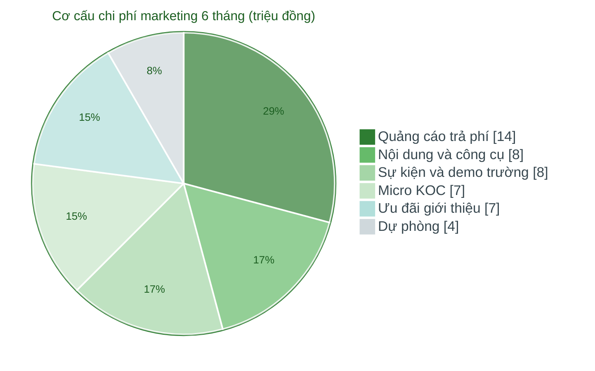

# Task 4: Dự kiến doanh thu và chi phí trong giai đoạn đầu

## Marketing & Growth Lead

**Người phụ trách:** Lê Phạm Kiều Duyên (Marketing và Growth Lead)
**Kế thừa:** PA2 lộ trình phát triển (giai đoạn Thí điểm thương mại Q4/2026), PA2 chân dung khách hàng (mức chi 40-60 nghìn một bữa), PA3 hạng mục 1 (SOM và ARPU), hạng mục 5 (phân vai kênh), hạng mục 9 (bảng chỉ số phễu, CAC và tỷ lệ trả trước)
**Phối hợp:** Business Development và Customer Success (Nguyễn Trọng Phúc) về tỷ lệ chuyển đổi beta sang trả phí, tỷ lệ giữ chân và tỷ lệ giới thiệu
**Trạng thái:** Hoàn thành phần Marketing

---

### 1. Phạm vi phần này và cách hiểu "giai đoạn đầu"

Phần này tính doanh thu và chi phí thuộc mảng marketing và tăng trưởng, tức phần doanh thu do hoạt động thu hút khách hàng mang về và phần chi phí bỏ ra để thu hút. Chi phí công nghệ, vận hành bếp và giao hàng, nhân sự chung nằm ở phần của CTO và phần tổng hợp của CEO, không tính trùng ở đây.

"Giai đoạn đầu" được chốt là **6 tháng đầu sau ra mắt, từ tháng 8/2026 đến tháng 1/2027**. Mốc này theo đúng lộ trình PA2: sản phẩm ra mắt ngày 8/8/2026, giai đoạn Thí điểm thương mại rơi vào Q4/2026 với chỉ tiêu 100 khách hàng trả phí, và bước sang giai đoạn Hoàn thiện giữ chân từ Q1/2027. Chọn 6 tháng để bảng số vừa phủ trọn giai đoạn thí điểm, vừa bắt được đoạn đầu của giai đoạn giữ chân, đủ dài để thấy xu hướng nhưng không dự phóng quá xa thành số tưởng tượng.

Nguyên tắc marketing có trách nhiệm đã cam kết ở PA3 vẫn giữ nguyên tại đây: mọi con số dưới đây là **số dự phóng có nêu rõ giả định và nguồn**, không phải số đo thật. Các con số minh họa thu được từ chiến dịch kiểm chứng PA3 được ghi rõ là số minh họa ở đúng tài liệu gốc.

### 2. Giả định nền, kế thừa từ PA2 và PA3

Toàn bộ mô hình đứng trên sáu giả định, mỗi giả định gắn một nguồn trong hồ sơ để người đọc kiểm tra ngược được, thay vì lấy số từ cảm tính.

| Giả định | Giá trị dùng trong mô hình | Nguồn kế thừa |
|---|---|---|
| ARPU: doanh thu bình quân trên một khách trả phí một tháng | 500 nghìn đồng | PA3 hạng mục 1: SOM khoảng 1.100 khách tương ứng 550 triệu đồng một tháng, suy ra 500 nghìn một khách |
| Giá bình quân một bữa | 50 nghìn đồng | PA2 chân dung (chấp nhận 40-60 nghìn), PA2 lộ trình mục 2 (mục tiêu 50-55 nghìn) |
| Biên đóng góp của nền tảng trên GMV | khoảng 12 phần trăm (khung 10-15 phần trăm) | PA2 lộ trình mục 2, cơ cấu kinh tế đơn vị: bếp nhận 70-75 phần trăm, phí giao 5-8 nghìn một bữa |
| Tỷ lệ chuyển đổi từ waitlist và beta sang khách trả phí | khoảng 25 phần trăm | PA2 lộ trình, chỉ tiêu chuyển tiếp Q4/2026 (ngưỡng dừng 15 phần trăm), thống nhất với Phúc |
| CAC tham chiếu kênh tự nhiên | khoảng 25 nghìn đồng một đăng ký (chi phí cơ hội) | PA3 hạng mục 9, cách quy đổi công sức theo 25 nghìn đồng một giờ |
| Tỷ lệ khách trả phí đến từ kênh marketing và growth | khoảng 90 phần trăm trong giai đoạn đầu | Kênh chính đều là kênh marketing (demo, TikTok, cộng đồng, giới thiệu), phần còn lại là truyền miệng tự nhiên |

Một điểm cần nói thẳng về ARPU: 500 nghìn đồng một tháng chỉ tương đương khoảng 10 bữa, tức khách giai đoạn đầu chủ yếu dùng gói tuần với vài bữa mỗi tuần chứ chưa thay thế toàn bộ bữa ăn. Đây là mức thận trọng có chủ ý. Khi khách chuyển sang gói tháng ăn đều đặn hằng ngày ở giai đoạn giữ chân, ARPU sẽ tăng dần về phía 1,5 đến 3 triệu đồng một tháng, nên mô hình này thiên về phía dưới của tiềm năng doanh thu.

### 3. Bảng dự kiến doanh thu và chi phí marketing 6 tháng đầu

Số khách trả phí lũy kế được đặt sao cho cán mốc khoảng 100 khách vào cuối Q4/2026, đúng chỉ tiêu chuyển tiếp của giai đoạn Thí điểm thương mại trong lộ trình PA2. Tháng 9 và tháng 1 được đẩy mạnh hơn vì trùng hai mùa nhu cầu cao: tựu trường và đầu năm mới.

| Tháng | Khách trả phí đang hoạt động | Doanh thu GMV (triệu đồng) | Biên đóng góp nền tảng ~12% (triệu đồng) | Chi phí marketing (triệu đồng) | Dòng đóng góp sau marketing (triệu đồng) |
|---|---|---|---|---|---|
| 8/2026 (ra mắt 8/8) | 15 | 7,5 | 0,9 | 6 | -5,1 |
| 9/2026 (tựu trường) | 35 | 17,5 | 2,1 | 9 | -6,9 |
| 10/2026 | 60 | 30,0 | 3,6 | 9 | -5,4 |
| 11/2026 | 95 | 47,5 | 5,7 | 8 | -2,3 |
| 12/2026 (cuối thí điểm) | 130 | 65,0 | 7,8 | 7 | +0,8 |
| 1/2027 (đầu năm mới) | 170 | 85,0 | 10,2 | 9 | +1,2 |
| **Tổng 6 tháng** | - | **252,5** | **30,3** | **48** | **-17,7** |

Cách đọc bảng:

- **Doanh thu GMV** là tổng giá trị khách trả cho NutriPlan. Đây là con số dùng cùng quy ước với SOM ở PA3 (doanh thu tính theo giá trị giao dịch), nhờ vậy 170 khách ở tháng cuối tương ứng 85 triệu đồng một tháng nằm đúng trên lộ trình tới SOM 550 triệu đồng một tháng của 1.100 khách.
- **Biên đóng góp nền tảng** là phần NutriPlan thực giữ lại sau khi trả bếp và phí giao, khoảng 12 phần trăm GMV. Đây mới là phần doanh thu thật của nền tảng để bù chi phí, nên phải tách ra thay vì nhìn GMV rồi tưởng lãi lớn.
- **Dòng đóng góp sau marketing** bằng biên đóng góp trừ chi phí marketing. Khối marketing âm trong bốn tháng đầu và **chuyển dương từ tháng 12/2026**, đây là mốc hòa vốn đóng góp ở cấp khối marketing.

Lưu ý quan trọng để không đọc nhầm: dòng đóng góp dương từ tháng 12 chỉ nói khối marketing tự nuôi được chi phí thu hút của chính nó, chưa gồm chi phí công nghệ, vận hành và nhân sự chung do các khối khác gánh. Điểm hòa vốn toàn dự án nằm ở phần tổng hợp của CEO, muộn hơn mốc này.

### 4. Cơ cấu chi phí marketing 6 tháng theo nhóm

Tổng 48 triệu đồng chi phí marketing chia theo nhóm hạng mục dưới đây. Cơ cấu này tôn trọng nguyên tắc đã chốt ở PA3 hạng mục 5: chưa mở quảng cáo trả phí khi chưa có thông điệp thắng, nên phần trả phí chỉ chiếm phần vừa phải và tăng dần sau khi có bằng chứng chuyển đổi.

| Nhóm chi phí | 6 tháng (triệu đồng) | Ghi chú |
|---|---|---|
| Sản xuất nội dung và công cụ marketing | 8 | Video, thiết kế, thực đơn mẫu, landing page, Zalo ZNS, công cụ đo lường |
| Quảng cáo trả phí có kiểm soát | 14 | TikTok và Facebook, mở dần từ tháng 9 sau khi chốt thông điệp thắng ở PA3 hạng mục 9 |
| Hợp tác Micro KOC sinh viên | 7 | Nhóm kênh PA3 đã hoãn vì thiếu thời gian, nay có nguồn lực để triển khai |
| Sự kiện và demo tại cụm trường | 8 | Standee, booth, sản phẩm dùng thử, mở rộng ra nhiều trường trong cụm |
| Ưu đãi giới thiệu và khuyến mãi ra mắt | 7 | Quy đổi giá trị giảm 10 phần trăm hai chiều và tặng bữa theo PA3 hạng mục 6 |
| Dự phòng marketing | 4 | Khoảng 8 phần trăm, cho biến động giá quảng cáo và cơ hội phát sinh |
| **Tổng** | **48** | |

### 5. Chỉ số hiệu quả: chi phí thu hút một khách và giá trị vòng đời

Số khách trả phí mới thu được trong 6 tháng, tính cả phần bù hao hụt do rời bỏ, ước khoảng 185 khách. Bảng dưới tách theo kênh để thấy kênh nào rẻ, kênh nào đắt, theo đúng phân vai kênh đã chốt ở PA3 hạng mục 5.

| Kênh thu hút | Khách trả phí 6 tháng | Chi phí phân bổ (triệu) | CAC (nghìn đồng) | Vai trò kế thừa PA3 |
|---|---|---|---|---|
| Demo và sự kiện tại cụm trường | 70 | 8 | ~115 | Kênh chuyển đổi chính (hạng mục 5) |
| Quảng cáo trả phí có kiểm soát | 60 | 14 | ~233 | Phủ sóng và chuyển đổi, mở sau khi có thông điệp thắng |
| Giới thiệu (referral loop) | 28 | 7 | ~250 | Vòng tăng trưởng (hạng mục 6) |
| Micro KOC sinh viên | 27 | 7 | ~260 | Tăng độ tin bằng đánh giá thật (hạng mục 6) |
| Chi phí dùng chung (nội dung, công cụ, dự phòng) | - | 12 | - | Phục vụ mọi kênh |
| **Tổng và CAC blended** | **185** | **48** | **~260** | |

CAC blended khoảng 260 nghìn đồng một khách trả phí. CAC từng kênh trong bảng chưa gồm phần chi phí dùng chung nên thấp hơn thực tế, con số blended 260 nghìn mới là con số phản ánh đúng vì đã tính hết chi phí.

Đặt cạnh giá trị vòng đời để biết CAC này có chấp nhận được không:

| Kịch bản | Tuổi thọ khách | Biên đóng góp một tháng | LTV (đóng góp) | LTV trên CAC |
|---|---|---|---|---|
| Giai đoạn đầu (thận trọng) | 6 tháng | 60 nghìn (12% của 500 nghìn) | 360 nghìn | ~1,4 lần |
| Sau khi giữ chân tốt (lộ trình Q1/2027 trở đi) | 12 tháng, biên cải thiện lên 15% | 90 nghìn | ~1,08 triệu | tăng mạnh khi CAC giảm |

Ở giai đoạn đầu LTV trên CAC khoảng 1,4 lần, tức mỗi đồng bỏ ra thu hút vẫn thu về nhiều hơn một đồng đóng góp, nhưng biên an toàn còn mỏng. Tỷ lệ này cải thiện theo hai hướng đã có trong lộ trình: giữ chân tốt hơn nhờ gói tháng làm tuổi thọ khách dài ra, và CAC giảm khi tỷ lệ khách đến từ kênh tự nhiên và giới thiệu tăng lên. Đây chính là các cột mốc marketing sẽ cam kết ở task 8.

---

## CTO/Founding Engineer
