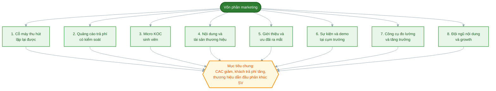

# Task 6: Mục đích sử dụng vốn

## Marketing & Growth Lead

**Người phụ trách:** Lê Phạm Kiều Duyên (Marketing và Growth Lead)
**Kế thừa:** PA3 hạng mục 5 (kênh chính và kênh phụ, điều kiện mở quảng cáo trả phí), hạng mục 6 (growth loop và ưu đãi ra mắt), hạng mục 8 (nội dung, landing page, cơ chế giới thiệu), hạng mục 9 (bảng chỉ số); Task 4 PA4 (cơ cấu chi phí marketing)
**Phối hợp:** Business Development và Customer Success về mục đích liên quan giữ chân và giới thiệu
**Trạng thái:** Hoàn thành phần Marketing

---

### 1. Nguyên tắc chi tiêu marketing sau khi nhận vốn

Trước khi liệt kê mục đích, cần nói rõ nguyên tắc, vì mục đích dùng vốn chỉ thuyết phục khi gắn với một kỷ luật chi tiêu. Ở PA3 nhóm đã chủ động không chạy quảng cáo trả phí khi chưa có bằng chứng chuyển đổi, để tránh đốt tiền khuếch đại một thông điệp chưa được kiểm chứng. Nguyên tắc đó không đổi khi có vốn, chỉ mở rộng thêm một vế: **vốn chỉ dùng để nhân những gì đã chứng minh được hiệu quả, không dùng để thử những gì chưa có bằng chứng.**

Nguyên tắc đó cụ thể hóa thành ba quy tắc chi tiêu:

- Chi cho kênh nào phải đo được kênh đó mang về bao nhiêu khách và với chi phí bao nhiêu, đúng cơ chế tách chỉ số theo kênh ở PA3 hạng mục 9.
- Quảng cáo trả phí chỉ mở sau khi đã có ít nhất một thông điệp cho tỷ lệ chuyển đổi vượt ngưỡng, đúng điều kiện đã chốt ở PA3 hạng mục 5.
- Mọi khoản đều có ngưỡng dừng và ngưỡng nhân, không có khoản chi nào chạy vô thời hạn mà không soi lại hiệu quả.

### 2. Danh sách mục đích sử dụng vốn cho mảng marketing

Vốn phần marketing dùng cho tám mục đích, xếp theo thứ tự ưu tiên. Mỗi mục đích nêu rõ dùng để làm gì, vì sao cần, và nối với phần nào trong hồ sơ.

| # | Mục đích | Dùng để làm gì | Vì sao cần |
|---|---|---|---|
| 1 | Xây dựng cỗ máy thu hút khách hàng lặp lại được | Chuyển từ cách làm thủ công quy mô nhỏ ở PA3 sang một quy trình thu hút chạy đều hằng tháng: sản xuất nội dung theo lịch, đo lường theo kênh, tối ưu liên tục | Đây là năng lực lõi của khối marketing. Không có cỗ máy này thì mọi khoản chi khác chỉ tạo ra một đợt tăng rồi tắt |
| 2 | Kiểm chứng và mở rộng kênh quảng cáo trả phí có kiểm soát | Chạy TikTok và Facebook Ads với thông điệp đã thắng ở giai đoạn organic, mở rộng độ phủ vượt khỏi số lớp demo nhóm đi được | PA3 chỉ ra kênh chính demo trực tiếp bị chặn trên bởi số buổi demo. Quảng cáo trả phí là cách gỡ trần đó, và điều kiện mở đã hội đủ sau ra mắt |
| 3 | Hợp tác Micro KOC sinh viên | Mời KOC 2.000 đến 20.000 người theo dõi trong trường trải nghiệm thật và chia sẻ trên TikTok, Facebook | Kênh này bị hoãn ở PA3 do thời gian tìm và thương lượng không khớp chiến dịch ngắn ngày. Có vốn và thời gian thì đây là kênh tăng độ tin rất hợp với phân khúc sinh viên |
| 4 | Sản xuất nội dung và tài sản thương hiệu ở quy mô lớn hơn | Mở rộng lịch nội dung tám mẩu ở PA3 thành dòng chảy nội dung đều đặn theo bốn nhóm giáo dục, bằng chứng, hậu trường, chuyển đổi; đầu tư bộ nhận diện và ảnh sản phẩm thật | Nội dung là nhiên liệu của mọi kênh. Khi đã có sản phẩm thật thay cho mockup, cần bằng chứng thật và nội dung chất lượng hơn để chuyển đổi |
| 5 | Vận hành chương trình giới thiệu và ưu đãi ra mắt | Cấp ngân sách cho ưu đãi giảm 10 phần trăm hai chiều và tặng bữa của referral loop, cho ưu đãi nhóm khi nhiều người cùng đăng ký một cụm | Referral loop ở PA3 hạng mục 6 là vòng tăng trưởng chi phí thấp nhất. Ưu đãi là phần chi bắt buộc để vòng lặp này chạy được, và giảm CAC về dài hạn |
| 6 | Sự kiện và demo tại cụm trường ở quy mô rộng | Nhân mô hình demo tại lớp và câu lạc bộ ra nhiều trường trong cụm ĐHQG Thủ Đức và các cụm lân cận, đầu tư standee, booth, sản phẩm dùng thử | Demo trực tiếp là kênh chuyển đổi cao nhất trong PA3. Đây là kênh đáng nhân nhất vì tiếp cận đúng người với niềm tin có sẵn |
| 7 | Công cụ đo lường và tăng trưởng | Trang bị landing page chuyên nghiệp, Zalo ZNS để chăm sóc người đăng ký ở quy mô thật, công cụ phân tích để vận hành bảng chỉ số PA3 hạng mục 9 mà không phải đếm tay | Ở PA3 nhóm đếm tay được vì mẫu vài chục người. Khi lên hàng trăm rồi hàng nghìn khách thì đo tay không còn khả thi, cần công cụ để giữ được kỷ luật đo lường |
| 8 | Mở rộng đội ngũ nội dung và growth | Thuê cộng tác viên nội dung và một nhân sự growth bán thời gian để giữ nhịp sản xuất và tối ưu kênh | Ở PA3 bốn thành viên tự làm mọi việc, chi phí quy đổi ra công sức. Khi quy mô tăng, nhân sự chuyên trách là điều kiện để hệ thống thu hút ở mục 1 chạy bền |

### 3. Ba nhóm mục đích quy về ba kết quả kinh doanh

Tám mục đích trên gom lại thành ba nhóm, mỗi nhóm phục vụ một kết quả kinh doanh cụ thể để nhà đầu tư thấy tiền đi vào đâu và tạo ra gì.

- **Nhóm thu hút (mục đích 2, 3, 6):** mở rộng độ phủ và số khách mới. Kết quả kỳ vọng: tăng số khách trả phí theo đúng lộ trình PA2, từ 100 khách cuối Q4/2026 lên các mốc quý sau.
- **Nhóm nền tảng (mục đích 1, 4, 7, 8):** dựng năng lực và tài sản dùng lại được. Kết quả kỳ vọng: CAC giảm dần theo thời gian nhờ nội dung, công cụ và đội ngũ làm việc hiệu quả hơn thay vì làm thủ công.
- **Nhóm giữ và lan (mục đích 5):** biến khách hài lòng thành nguồn khách mới. Kết quả kỳ vọng: tỷ lệ khách mới đến từ giới thiệu tăng dần, đúng chỉ tiêu 25 đến 30 phần trăm khách mới từ kênh giới thiệu ở giai đoạn Tăng trưởng của lộ trình PA2.

### 4. Những gì vốn marketing chủ động không dùng vào

Nêu rõ ranh giới cũng quan trọng như nêu mục đích, để nhà đầu tư thấy có kỷ luật chi tiêu.

- Không dùng để mua lượng theo dõi ảo hoặc tương tác ảo. Chỉ số ảo phá hỏng chính bảng đo lường mà nhóm dựa vào để ra quyết định.
- Không dồn ngân sách vào quảng cáo trả phí trước khi có thông điệp thắng, đúng điều kiện PA3 hạng mục 5.
- Không chi cho các kênh không đo được nguồn khách. Kênh nào không tách được chỉ số theo PA3 hạng mục 9 thì chưa rót ngân sách lớn.

---

## CTO/Founding Engineer
