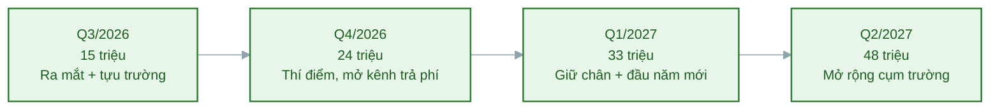

# Task 7: Kế hoạch sử dụng vốn theo từng hạng mục

## Marketing & Growth Lead

**Người phụ trách:** Lê Phạm Kiều Duyên (Marketing và Growth Lead)
**Kế thừa:** Task 6 PA4 (tám mục đích sử dụng vốn marketing), Task 4 PA4 (cơ cấu chi phí 6 tháng); PA2 lộ trình phát triển (các mốc quý sau ra mắt); PA3 hạng mục 5, 6, 8, 9
**Phối hợp:** Business Development và Customer Success về ngân sách ưu đãi giới thiệu và giữ chân
**Trạng thái:** Hoàn thành phần Marketing

---

### 1. Phạm vi và hạn mức vốn marketing

Task 6 nêu tám mục đích dùng vốn. Task này gắn số tiền và thời điểm cho từng mục đích, chia theo hạng mục cụ thể và theo quý.

Phạm vi thời gian là **12 tháng đầu sau ra mắt, từ tháng 8/2026 đến tháng 7/2027**. Chọn 12 tháng vì đây là khoảng runway điển hình mà một vòng vốn tài trợ, đủ dài để phủ qua ba giai đoạn của lộ trình PA2: Thí điểm thương mại (Q4/2026), Hoàn thiện giữ chân (Q1/2027) và Tự động hóa mở rộng (Q2 đến Q3/2027).

**Hạn mức vốn phần marketing: 120 triệu đồng cho 12 tháng.** Con số này khớp với Task 4: sáu tháng đầu (8/2026 đến 1/2027) chi 48 triệu đồng đúng bằng tổng chi phí marketing trong bảng dự phóng, sáu tháng sau chi thêm 72 triệu khi mở rộng kênh trả phí và KOC. Hạn mức này là một dòng trong tổng nhu cầu vốn mà Operations Manager tổng hợp ở task 5, và là phần marketing mà CEO hợp nhất ở task 7 cấp toàn dự án.

### 2. Kế hoạch sử dụng vốn theo hạng mục và theo quý

Đơn vị: triệu đồng. Các quý bám mốc lộ trình PA2. Q3/2026 chỉ gồm hai tháng 8 và 9 vì ra mắt ngày 8/8.

| Hạng mục chi (nối với mục đích ở task 6) | Q3/2026 (8-9) | Q4/2026 (10-12) | Q1/2027 (1-3) | Q2/2027 (4-6) | Tổng | Tỷ trọng |
|---|---|---|---|---|---|---|
| Quảng cáo trả phí có kiểm soát (mục đích 2) | 3 | 9 | 12 | 21 | 45 | 37,5% |
| Hợp tác Micro KOC sinh viên (mục đích 3) | 2 | 4 | 4 | 6 | 16 | 13,3% |
| Sản xuất nội dung và tài sản thương hiệu (mục đích 4) | 4 | 4 | 5 | 5 | 18 | 15,0% |
| Ưu đãi giới thiệu và khuyến mãi ra mắt (mục đích 5) | 3 | 3 | 4 | 5 | 15 | 12,5% |
| Sự kiện và demo tại cụm trường (mục đích 6) | 2 | 2 | 3 | 5 | 12 | 10,0% |
| Công cụ đo lường và tăng trưởng (mục đích 7) | 1 | 1 | 2 | 2 | 6 | 5,0% |
| Cộng tác viên nội dung và growth (mục đích 8) | 0 | 1 | 2 | 3 | 6 | 5,0% |
| Dự phòng marketing | 0 | 0 | 1 | 1 | 2 | 1,7% |
| **Tổng theo quý** | **15** | **24** | **33** | **48** | **120** | **100%** |

Kiểm tra nhất quán với Task 4: sáu tháng đầu gồm trọn Q3/2026 (15 triệu, tháng 8 và 9), trọn Q4/2026 (24 triệu, tháng 10 đến 12) và tháng 1/2027 (9 triệu, phần đầu của Q1), cộng lại đúng 48 triệu đồng, khớp tổng chi phí marketing 6 tháng trong bảng dự phóng doanh thu và chi phí ở task 4.

### 3. Diễn giải chi tiêu theo quý, gắn với thời điểm

Cách phân bổ không đều theo thời gian có chủ đích: chi tăng dần theo đường cong hiệu quả. Chi ít khi còn dò kênh, chi mạnh khi đã biết kênh nào và thông điệp nào cho kết quả tốt nhất.

- **Q3/2026 (tháng 8 đến 9), 15 triệu.** Trọng tâm là ra mắt và tận dụng mùa tựu trường. Ngân sách nghiêng về nội dung và sự kiện tại trường, kênh chuyển đổi rẻ và chắc nhất. Quảng cáo trả phí chỉ chi 3 triệu để thử nghiệm ở quy mô nhỏ, mở khi thông điệp thắng đã lộ ra từ giai đoạn organic PA3.
- **Q4/2026 (tháng 10 đến 12), 24 triệu.** Đây là quý Thí điểm thương mại với chỉ tiêu 100 khách trả phí. Quảng cáo trả phí tăng lên 9 triệu vì đã có bằng chứng kênh nào chuyển đổi, KOC bắt đầu vào cuộc. Đây là quý nhân những gì đã chứng minh được.
- **Q1/2027 (tháng 1 đến 3), 33 triệu.** Giai đoạn Hoàn thiện giữ chân với chỉ tiêu 400 đến 500 khách. Tăng ngân sách giới thiệu và bắt đầu thuê cộng tác viên để giữ nhịp nội dung. Tháng 1 tận dụng mùa nhu cầu sống lành mạnh đầu năm.
- **Q2/2027 (tháng 4 đến 6), 48 triệu.** Giai đoạn Tự động hóa và mở rộng, mở thêm cụm trường. Chi mạnh nhất cho quảng cáo trả phí và sự kiện vì lúc này đã có hệ thống thu hút và công cụ đo lường vận hành ổn định, mỗi đồng chi tạo ra nhiều khách hơn so với giai đoạn đầu.

### 4. Điều kiện giải ngân từng khoản

Không khoản nào được giải ngân chỉ vì đến kỳ. Mỗi nhóm chi gắn một điều kiện, đúng kỷ luật chi tiêu đã nêu ở task 6.

| Nhóm chi | Điều kiện mở hoặc tăng ngân sách | Ngưỡng dừng hoặc soi lại |
|---|---|---|
| Quảng cáo trả phí | Đã có ít nhất một thông điệp cho tỷ lệ chuyển đổi vượt ngưỡng ở PA3 hạng mục 9, bản web app đã chạy | CAC của kênh vượt trần đặt trước hoặc tỷ lệ chuyển đổi dưới 1 phần trăm thì dừng để soi lại |
| Micro KOC | KOC có tệp trùng ICP và đo được nguồn khách bằng mã giới thiệu riêng | KOC không mang về đăng ký đo được thì không gia hạn |
| Ưu đãi giới thiệu | Referral loop có người tham gia thật và đo được số lượt giới thiệu | Chi phí ưu đãi trên một khách giới thiệu vượt CAC kênh khác thì điều chỉnh mức ưu đãi |
| Sự kiện và demo | Còn dư địa trường chưa tiếp cận trong cụm mục tiêu | Tỷ lệ chuyển đổi tại demo giảm rõ thì xem lại phần trình bày trước khi mở thêm buổi |

### 5. Kế thừa và liên kết

- **Task 6 PA4:** mỗi hạng mục chi ở đây gắn đúng một mục đích trong danh sách tám mục đích, cột đầu bảng ghi rõ mối nối.
- **Task 4 PA4:** tổng chi 6 tháng đầu 48 triệu đồng khớp bảng dự phóng doanh thu và chi phí, bảo đảm hai tài liệu không mâu thuẫn số.
- **PA2 lộ trình:** phân bổ theo quý khớp ba giai đoạn thương mại và chỉ tiêu khách của từng giai đoạn.
- **PA3 hạng mục 5 và 9:** điều kiện giải ngân quảng cáo trả phí và các ngưỡng dừng lấy nguyên tắc từ điều kiện mở kênh và cây quyết định của PA3.
- **Task 5 PA4:** hạn mức 120 triệu đồng là dòng marketing trong tổng nhu cầu vốn do Operations Manager tính.
- **Task 8 PA4:** mỗi khoản chi ở đây có một cột mốc phát triển tương ứng để kiểm chứng tiền chi có tạo ra kết quả.

### 6. Nguồn tham khảo

| Nội dung dùng | Nguồn |
|---|---|
| Tám mục đích sử dụng vốn marketing | `docs/PA4-goi-von/06-muc-dich-su-dung-von.md` |
| Cơ cấu và tổng chi phí marketing 6 tháng | `docs/PA4-goi-von/04-du-kien-doanh-thu-va-chi-phi.md` |
| Mốc quý, chỉ tiêu khách từng giai đoạn | `docs/PA2-san-pham/09-lo-trinh-phat-trien.md` |
| Điều kiện mở kênh trả phí, ngưỡng quyết định | `docs/PA3-quang-ba/05-kenh-quang-ba.md`, `docs/PA3-quang-ba/09-chi-so-do-luong.md` |
| Cơ chế và ưu đãi giới thiệu | `docs/PA3-quang-ba/06-chien-luoc-khach-hang-dau-tien.md` |

---

## CTO/Founding Engineer
