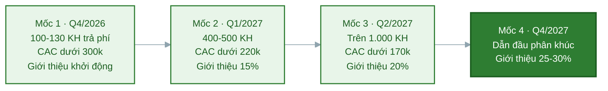

# Task 8: Các cột mốc phát triển sau khi nhận vốn

## Marketing & Growth Lead

**Người phụ trách:** Lê Phạm Kiều Duyên (Marketing và Growth Lead)
**Kế thừa:** PA3 hạng mục 9 (phễu Reach, Interest, Activation, Revenue, Referral và các chỉ số), hạng mục 5 (phân vai kênh), hạng mục 6 (referral loop); PA2 lộ trình phát triển (chỉ tiêu khách từng quý); Task 4 và Task 7 PA4
**Phối hợp:** Business Development và Customer Success về cột mốc giữ chân và giới thiệu
**Trạng thái:** Hoàn thành phần Marketing

---

### 1. Cách đặt cột mốc marketing

Cột mốc marketing được đặt theo cùng khung phễu năm tầng đã dùng ở PA3 hạng mục 9, để khi vận hành thật chỉ việc điền số vào đúng khung đã có thay vì nghĩ lại cách đo. Mỗi cột mốc gắn một mốc thời gian, một kết quả marketing cụ thể và các chỉ số đo được, theo đúng mốc quý và chỉ tiêu khách của lộ trình PA2 nhưng nhìn dưới góc marketing.

Ba chỉ số xương sống theo suốt bốn cột mốc:

- **Số khách trả phí do marketing mang về**, đo mức đóng góp của khối vào doanh thu.
- **CAC blended**, đo mức hiệu quả của chi tiêu, mục tiêu giảm dần theo thời gian.
- **Tỷ lệ khách mới đến từ giới thiệu**, đo mức tự tăng trưởng của hệ thống, mục tiêu tăng dần.

Ba chỉ số này đi cùng nhau kể một câu chuyện: khách tăng, chi phí trên mỗi khách giảm, và ngày càng nhiều khách tự đến qua giới thiệu. Đó là dấu hiệu của một cỗ máy tăng trưởng lành mạnh chứ không phải tăng trưởng mua bằng tiền.

### 2. Bốn cột mốc phát triển marketing

| Cột mốc | Thời gian | Kết quả marketing đạt được | Chỉ số đo cụ thể |
|---|---|---|---|
| **Mốc 1: Cỗ máy thu hút vận hành** | Q4/2026 (0 đến 3 tháng sau vốn) | Chốt được thông điệp thắng bằng số thật, kênh trả phí bắt đầu chạy có kiểm soát, cộng đồng người dùng đầu tiên hình thành | Đạt 100 đến 130 khách trả phí (mục tiêu lộ trình PA2 là 100), phần lớn do marketing mang về; reach khoảng 8.000 đến 12.000 người một tháng; CAC blended dưới 300 nghìn; tỷ lệ chuyển đổi beta sang trả phí từ 25 phần trăm; cộng đồng đạt 2.000 thành viên |
| **Mốc 2: Nhận diện trong cụm ĐHQG** | Q1/2027 (3 đến 6 tháng) | NutriPlan thành cái tên quen trong cụm trường mục tiêu; referral loop chạy đều; 8 đến 12 KOC sinh viên đã hợp tác; chăm sóc người đăng ký tự động hóa qua Zalo | Đạt 400 đến 500 khách trả phí; CAC blended dưới 220 nghìn; tỷ lệ khách mới từ giới thiệu từ 15 phần trăm; reach khoảng 20.000 người một tháng; giữ nhịp tối thiểu 12 mẩu nội dung một tháng |
| **Mốc 3: Mở rộng ra nhiều cụm trường** | Q2/2027 (6 đến 9 tháng) | Nhân mô hình thu hút sang 2 đến 3 cụm trường mới tại TP.HCM; hệ thống nội dung và đo lường vận hành ổn định; LTV trên CAC vượt 2 lần | Đạt trên 1.000 khách trả phí do marketing mang về; CAC blended dưới 170 nghìn; tỷ lệ khách mới từ giới thiệu từ 20 phần trăm; reach khoảng 35.000 người một tháng |
| **Mốc 4: Thương hiệu dẫn đầu phân khúc** | Từ Q4/2027 (triển vọng) | NutriPlan là thương hiệu suất ăn healthy được nhắc đến đầu tiên trong phân khúc sinh viên tại các cụm trường TP.HCM; kênh giới thiệu thành nguồn khách chủ lực | 25 đến 30 phần trăm khách mới đến từ kênh giới thiệu (đúng chỉ tiêu lộ trình PA2); CAC blended tiếp tục giảm nhờ tỷ trọng kênh tự nhiên tăng; thương hiệu có mặt ở các cụm trường lớn |

### 3. Ba chỉ số xương sống theo mốc, nhìn xu hướng

Xếp riêng ba chỉ số này qua bốn mốc để thấy rõ xu hướng của tăng trưởng.

| Chỉ số | Mốc 1 (Q4/2026) | Mốc 2 (Q1/2027) | Mốc 3 (Q2/2027) | Mốc 4 (Q4/2027) |
|---|---|---|---|---|
| Khách trả phí lũy kế (marketing đóng góp phần lớn) | 100-130 | 400-500 | trên 1.000 | hướng tới quy mô SOM |
| CAC blended (nghìn đồng) | dưới 300 | dưới 220 | dưới 170 | tiếp tục giảm |
| Tỷ lệ khách mới từ giới thiệu | khởi động | từ 15% | từ 20% | 25-30% |

Xu hướng cần đạt: khách tăng theo cấp số, CAC giảm đều, giới thiệu tăng đều. Nếu khách tăng nhưng CAC không giảm thì tăng trưởng đang mua bằng tiền chứ chưa bền, đó là tín hiệu để soi lại cơ cấu kênh theo cây quyết định PA3 hạng mục 9.

---

## Business Development & Customer Success

## CTO/Founding Engineer

## Lead Full-stack Developer & UI/UX Design

## Operations Manager - Logistics & Partners
