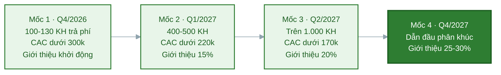

# Task 8: Các cột mốc phát triển sau khi nhận vốn

## Marketing & Growth Lead

**Người phụ trách:** Lê Phạm Kiều Duyên (Marketing và Growth Lead)
**Kế thừa:** PA3 hạng mục 9 (phễu Reach, Interest, Activation, Revenue, Referral và các chỉ số), hạng mục 5 (phân vai kênh), hạng mục 6 (referral loop); PA2 lộ trình phát triển (chỉ tiêu khách từng quý); Task 4 và Task 7 PA4
**Phối hợp:** Business Development và Customer Success về cột mốc giữ chân và giới thiệu
**Trạng thái:** Hoàn thành phần Marketing

---

### 1. Cách đặt cột mốc marketing

Cột mốc marketing được đặt theo cùng khung phễu năm tầng đã dùng ở PA3 hạng mục 9, để khi vận hành thật chỉ việc điền số vào đúng khung đã có thay vì nghĩ lại cách đo. Mỗi cột mốc gắn một mốc thời gian, một kết quả marketing cụ thể và các chỉ số đo được, theo đúng mốc quý và chỉ tiêu khách của lộ trình PA2 nhưng nhìn dưới góc marketing.

Ba chỉ số xương sống theo suốt bốn cột mốc:

- **Số khách trả phí do marketing mang về**, đo mức đóng góp của khối vào doanh thu.
- **CAC blended**, đo mức hiệu quả của chi tiêu, mục tiêu giảm dần theo thời gian.
- **Tỷ lệ khách mới đến từ giới thiệu**, đo mức tự tăng trưởng của hệ thống, mục tiêu tăng dần.

Ba chỉ số này đi cùng nhau kể một câu chuyện: khách tăng, chi phí trên mỗi khách giảm, và ngày càng nhiều khách tự đến qua giới thiệu. Đó là dấu hiệu của một cỗ máy tăng trưởng lành mạnh chứ không phải tăng trưởng mua bằng tiền.

### 2. Bốn cột mốc phát triển marketing

| Cột mốc | Thời gian | Kết quả marketing đạt được | Chỉ số đo cụ thể |
|---|---|---|---|
| **Mốc 1: Cỗ máy thu hút vận hành** | Q4/2026 (0 đến 3 tháng sau vốn) | Chốt được thông điệp thắng bằng số thật, kênh trả phí bắt đầu chạy có kiểm soát, cộng đồng người dùng đầu tiên hình thành | Đạt 100 đến 130 khách trả phí (mục tiêu lộ trình PA2 là 100), phần lớn do marketing mang về; reach khoảng 8.000 đến 12.000 người một tháng; CAC blended dưới 300 nghìn; tỷ lệ chuyển đổi beta sang trả phí từ 25 phần trăm; cộng đồng đạt 2.000 thành viên |
| **Mốc 2: Nhận diện trong cụm ĐHQG** | Q1/2027 (3 đến 6 tháng) | NutriPlan thành cái tên quen trong cụm trường mục tiêu; referral loop chạy đều; 8 đến 12 KOC sinh viên đã hợp tác; chăm sóc người đăng ký tự động hóa qua Zalo | Đạt 400 đến 500 khách trả phí; CAC blended dưới 220 nghìn; tỷ lệ khách mới từ giới thiệu từ 15 phần trăm; reach khoảng 20.000 người một tháng; giữ nhịp tối thiểu 12 mẩu nội dung một tháng |
| **Mốc 3: Mở rộng ra nhiều cụm trường** | Q2/2027 (6 đến 9 tháng) | Nhân mô hình thu hút sang 2 đến 3 cụm trường mới tại TP.HCM; hệ thống nội dung và đo lường vận hành ổn định; LTV trên CAC vượt 2 lần | Đạt trên 1.000 khách trả phí do marketing mang về; CAC blended dưới 170 nghìn; tỷ lệ khách mới từ giới thiệu từ 20 phần trăm; reach khoảng 35.000 người một tháng |
| **Mốc 4: Thương hiệu dẫn đầu phân khúc** | Từ Q4/2027 (triển vọng) | NutriPlan là thương hiệu suất ăn healthy được nhắc đến đầu tiên trong phân khúc sinh viên tại các cụm trường TP.HCM; kênh giới thiệu thành nguồn khách chủ lực | 25 đến 30 phần trăm khách mới đến từ kênh giới thiệu (đúng chỉ tiêu lộ trình PA2); CAC blended tiếp tục giảm nhờ tỷ trọng kênh tự nhiên tăng; thương hiệu có mặt ở các cụm trường lớn |

### 3. Ba chỉ số xương sống theo mốc, nhìn xu hướng

Xếp riêng ba chỉ số này qua bốn mốc để thấy rõ xu hướng của tăng trưởng.

| Chỉ số | Mốc 1 (Q4/2026) | Mốc 2 (Q1/2027) | Mốc 3 (Q2/2027) | Mốc 4 (Q4/2027) |
|---|---|---|---|---|
| Khách trả phí lũy kế (marketing đóng góp phần lớn) | 100-130 | 400-500 | trên 1.000 | hướng tới quy mô SOM |
| CAC blended (nghìn đồng) | dưới 300 | dưới 220 | dưới 170 | tiếp tục giảm |
| Tỷ lệ khách mới từ giới thiệu | khởi động | từ 15% | từ 20% | 25-30% |

Xu hướng cần đạt: khách tăng theo cấp số, CAC giảm đều, giới thiệu tăng đều. Nếu khách tăng nhưng CAC không giảm thì tăng trưởng đang mua bằng tiền chứ chưa bền, đó là tín hiệu để soi lại cơ cấu kênh theo cây quyết định PA3 hạng mục 9.

### 4. Vì sao các cột mốc này đáng tin

- **Bám chỉ tiêu đã có.** Mốc khách trả phí lấy đúng chỉ tiêu chuyển tiếp của lộ trình PA2 (100 khách Q4/2026, 400 đến 500 khách Q1/2027), không phải con số marketing tự đặt.
- **CAC giảm dần có cơ chế rõ ràng.** CAC giảm vì ba lý do cụ thể: tài sản nội dung và công cụ dùng lại được nên chi phí trên mỗi khách giảm, tỷ lệ khách đến từ giới thiệu (kênh gần như miễn phí) tăng, và đội ngũ vận hành kênh ngày càng thạo. Cả ba đều là kết quả trực tiếp của các khoản chi ở task 7.
- **Đo được ngay từ mốc đầu.** Mọi chỉ số ở đây đều nằm trong bảng phễu PA3 hạng mục 9 đã có công thức và nguồn dữ liệu, nên không phải chờ dựng hệ đo mới, chỉ việc điền số khi vận hành thật.

### 5. Kế thừa và liên kết

- **PA3 hạng mục 9:** khung phễu năm tầng và các chỉ số là gốc để đặt cột mốc; hai con số PA3 dặn dùng lại cho PA4 là CAC và tỷ lệ trả trước đều xuất hiện ở đây.
- **PA3 hạng mục 5 và 6:** cột mốc về giới thiệu và mở kênh dựa trên phân vai kênh và referral loop; phần cột mốc giới thiệu phối hợp với Phúc vì thuộc phần cuối phễu.
- **PA2 lộ trình:** mốc thời gian và chỉ tiêu khách của bốn cột mốc trùng khớp bốn giai đoạn thương mại sau ra mắt.
- **Task 4 và Task 7 PA4:** mốc khách và CAC là kết quả kỳ vọng của bảng dự phóng và kế hoạch chi ở hai task trên; đặt cạnh nhau để kiểm chứng tiền chi có tạo ra kết quả cam kết.
- **Task 8 các phần khác:** cột mốc marketing về số khách tiếp cận nối với cột mốc kinh doanh của Business Development (số đối tác, giữ chân), cột mốc sản phẩm của CTO và Lead Full-stack, và cột mốc vận hành của Operations Manager để tạo bức tranh phát triển toàn dự án.

### 6. Nguồn tham khảo

| Nội dung dùng | Nguồn |
|---|---|
| Khung phễu năm tầng, chỉ số CAC, cách tách theo kênh | `docs/PA3-quang-ba/09-chi-so-do-luong.md` |
| Phân vai kênh chính và phụ | `docs/PA3-quang-ba/05-kenh-quang-ba.md` |
| Referral loop và tỷ lệ khách từ giới thiệu | `docs/PA3-quang-ba/06-chien-luoc-khach-hang-dau-tien.md` |
| Chỉ tiêu khách từng quý (100; 400-500; 1.500-2.000; 25-30% từ giới thiệu) | `docs/PA2-san-pham/09-lo-trinh-phat-trien.md` |
| Bảng dự phóng và kế hoạch chi marketing | `docs/PA4-goi-von/04-du-kien-doanh-thu-va-chi-phi.md`, `docs/PA4-goi-von/07-ke-hoach-su-dung-von.md` |

---

## Business Development & Customer Success

## CTO/Founding Engineer

## Lead Full-stack Developer & UI/UX Design

## Operations Manager - Logistics & Partners
**Kế thừa:** PA2 Lộ trình phát triển, Task 5 (Nhu cầu gọi vốn), Kế hoạch Soft Launch, Kế hoạch vận hành MVP

**Trạng thái:** Hoàn thành phần Operation Managers

---

# 1. Mục tiêu

Sau khi nhận được nguồn vốn đầu tư, bộ phận Operations tập trung xây dựng hệ thống vận hành ổn định và mở rộng mạng lưới đối tác nhằm đảm bảo NutriPlan có khả năng phục vụ khách hàng hiệu quả trong giai đoạn MVP và sẵn sàng mở rộng quy mô khi bước vào giai đoạn thương mại.

Các cột mốc dưới đây được xây dựng theo lộ trình phát triển của dự án và tập trung vào ba mục tiêu chính:

- Hoàn thiện quy trình vận hành.
- Mở rộng mạng lưới đối tác bếp và logistics.
- Nâng cao chất lượng dịch vụ và khả năng mở rộng.

---

# 2. Các cột mốc phát triển

| Thời gian | Cột mốc | Chỉ số mục tiêu |
|-----------|----------|----------------|
| Tháng 1 sau khi nhận vốn | Hoàn thiện quy trình phối hợp giữa NutriPlan và bếp đối tác | Ban hành quy trình vận hành (SOP) và quy trình xử lý đơn hàng |
| Tháng 2 | Ký kết các đối tác cung cấp suất ăn healthy phục vụ giai đoạn MVP | Ít nhất 2 bếp đối tác tham gia hệ thống |
| Tháng 2 | Thiết lập quy trình giao nhận với đơn vị vận chuyển | Hoàn thành quy trình giao hàng và xử lý sự cố |
| Tháng 3 | Triển khai vận hành Soft Launch | 100% đơn hàng thử nghiệm được xử lý theo quy trình chuẩn |
| Tháng 4 | Đánh giá hiệu quả vận hành và tối ưu quy trình | Thời gian xử lý đơn hàng giảm so với giai đoạn thử nghiệm; cập nhật SOP khi cần |
| Tháng 5 | Mở rộng mạng lưới đối tác | Tối thiểu 4 bếp đối tác và 2 đối tác giao hàng hoạt động |
| Tháng 6 | Sẵn sàng cho giai đoạn mở bán chính thức | Quy trình vận hành ổn định, đáp ứng nhu cầu mở rộng khách hàng |

---

# 3. Các chỉ số đánh giá

Để theo dõi hiệu quả của mảng vận hành và logistics, NutriPlan sử dụng các chỉ số sau:

| Chỉ số | Mục tiêu |
|---------|-----------|
| Số lượng bếp đối tác | ≥ 4 đối tác |
| Số lượng đối tác giao hàng | ≥ 2 đối tác |
| Tỷ lệ đơn hàng được xử lý đúng quy trình | ≥ 95% |
| Tỷ lệ giao hàng đúng thời gian cam kết | ≥ 95% |
| Tỷ lệ sự cố vận hành được xử lý trong ngày | ≥ 90% |
| Thời gian phản hồi đối tác | Trong vòng 24 giờ |

---

# 4. Kết quả kỳ vọng

Sau khi hoàn thành các cột mốc trên, NutriPlan kỳ vọng:

- Xây dựng được mạng lưới đối tác đủ năng lực phục vụ giai đoạn MVP.
- Hoàn thiện quy trình phối hợp giữa nền tảng, bếp đối tác và đơn vị giao hàng.
- Đảm bảo hoạt động vận hành ổn định trước khi mở bán chính thức.
- Tạo nền tảng để mở rộng sang các khu vực mới mà không cần thay đổi lớn về quy trình vận hành.