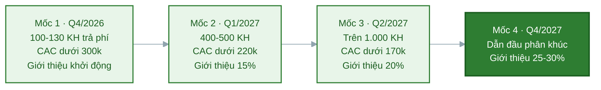

# Task 8: Các cột mốc phát triển sau khi nhận vốn

## Marketing & Growth Lead

**Người phụ trách:** Lê Phạm Kiều Duyên (Marketing và Growth Lead)
**Kế thừa:** PA3 hạng mục 9 (phễu Reach, Interest, Activation, Revenue, Referral và các chỉ số), hạng mục 5 (phân vai kênh), hạng mục 6 (referral loop); PA2 lộ trình phát triển (chỉ tiêu khách từng quý); Task 4 và Task 7 PA4
**Phối hợp:** Business Development và Customer Success về cột mốc giữ chân và giới thiệu
**Trạng thái:** Hoàn thành phần Marketing

---

### 1. Cách đặt cột mốc marketing

Cột mốc marketing được đặt theo cùng khung phễu năm tầng đã dùng ở PA3 hạng mục 9, để khi vận hành thật chỉ việc điền số vào đúng khung đã có thay vì nghĩ lại cách đo. Mỗi cột mốc gắn một mốc thời gian, một kết quả marketing cụ thể và các chỉ số đo được, theo đúng mốc quý và chỉ tiêu khách của lộ trình PA2 nhưng nhìn dưới góc marketing.

Ba chỉ số xương sống theo suốt bốn cột mốc:

- **Số khách trả phí do marketing mang về**, đo mức đóng góp của khối vào doanh thu.
- **CAC blended**, đo mức hiệu quả của chi tiêu, mục tiêu giảm dần theo thời gian.
- **Tỷ lệ khách mới đến từ giới thiệu**, đo mức tự tăng trưởng của hệ thống, mục tiêu tăng dần.

Ba chỉ số này đi cùng nhau kể một câu chuyện: khách tăng, chi phí trên mỗi khách giảm, và ngày càng nhiều khách tự đến qua giới thiệu. Đó là dấu hiệu của một cỗ máy tăng trưởng lành mạnh chứ không phải tăng trưởng mua bằng tiền.

### 2. Bốn cột mốc phát triển marketing

| Cột mốc | Thời gian | Kết quả marketing đạt được | Chỉ số đo cụ thể |
|---|---|---|---|
| **Mốc 1: Cỗ máy thu hút vận hành** | Q4/2026 (0 đến 3 tháng sau vốn) | Chốt được thông điệp thắng bằng số thật, kênh trả phí bắt đầu chạy có kiểm soát, cộng đồng người dùng đầu tiên hình thành | Đạt 100 đến 130 khách trả phí (mục tiêu lộ trình PA2 là 100), phần lớn do marketing mang về; reach khoảng 8.000 đến 12.000 người một tháng; CAC blended dưới 300 nghìn; tỷ lệ chuyển đổi beta sang trả phí từ 25 phần trăm; cộng đồng đạt 2.000 thành viên |
| **Mốc 2: Nhận diện trong cụm ĐHQG** | Q1/2027 (3 đến 6 tháng) | NutriPlan thành cái tên quen trong cụm trường mục tiêu; referral loop chạy đều; 8 đến 12 KOC sinh viên đã hợp tác; chăm sóc người đăng ký tự động hóa qua Zalo | Đạt 400 đến 500 khách trả phí; CAC blended dưới 220 nghìn; tỷ lệ khách mới từ giới thiệu từ 15 phần trăm; reach khoảng 20.000 người một tháng; giữ nhịp tối thiểu 12 mẩu nội dung một tháng |
| **Mốc 3: Mở rộng ra nhiều cụm trường** | Q2/2027 (6 đến 9 tháng) | Nhân mô hình thu hút sang 2 đến 3 cụm trường mới tại TP.HCM; hệ thống nội dung và đo lường vận hành ổn định; LTV trên CAC vượt 2 lần | Đạt trên 1.000 khách trả phí do marketing mang về; CAC blended dưới 170 nghìn; tỷ lệ khách mới từ giới thiệu từ 20 phần trăm; reach khoảng 35.000 người một tháng |
| **Mốc 4: Thương hiệu dẫn đầu phân khúc** | Từ Q4/2027 (triển vọng) | NutriPlan là thương hiệu suất ăn healthy được nhắc đến đầu tiên trong phân khúc sinh viên tại các cụm trường TP.HCM; kênh giới thiệu thành nguồn khách chủ lực | 25 đến 30 phần trăm khách mới đến từ kênh giới thiệu (đúng chỉ tiêu lộ trình PA2); CAC blended tiếp tục giảm nhờ tỷ trọng kênh tự nhiên tăng; thương hiệu có mặt ở các cụm trường lớn |

### 3. Ba chỉ số xương sống theo mốc, nhìn xu hướng

Xếp riêng ba chỉ số này qua bốn mốc để thấy rõ xu hướng của tăng trưởng.

| Chỉ số | Mốc 1 (Q4/2026) | Mốc 2 (Q1/2027) | Mốc 3 (Q2/2027) | Mốc 4 (Q4/2027) |
|---|---|---|---|---|
| Khách trả phí lũy kế (marketing đóng góp phần lớn) | 100-130 | 400-500 | trên 1.000 | hướng tới quy mô SOM |
| CAC blended (nghìn đồng) | dưới 300 | dưới 220 | dưới 170 | tiếp tục giảm |
| Tỷ lệ khách mới từ giới thiệu | khởi động | từ 15% | từ 20% | 25-30% |

Xu hướng cần đạt: khách tăng theo cấp số, CAC giảm đều, giới thiệu tăng đều. Nếu khách tăng nhưng CAC không giảm thì tăng trưởng đang mua bằng tiền chứ chưa bền, đó là tín hiệu để soi lại cơ cấu kênh theo cây quyết định PA3 hạng mục 9.

### 4. Vì sao các cột mốc này đáng tin

- **Bám chỉ tiêu đã có.** Mốc khách trả phí lấy đúng chỉ tiêu chuyển tiếp của lộ trình PA2 (100 khách Q4/2026, 400 đến 500 khách Q1/2027), không phải con số marketing tự đặt.
- **CAC giảm dần có cơ chế rõ ràng.** CAC giảm vì ba lý do cụ thể: tài sản nội dung và công cụ dùng lại được nên chi phí trên mỗi khách giảm, tỷ lệ khách đến từ giới thiệu (kênh gần như miễn phí) tăng, và đội ngũ vận hành kênh ngày càng thạo. Cả ba đều là kết quả trực tiếp của các khoản chi ở task 7.
- **Đo được ngay từ mốc đầu.** Mọi chỉ số ở đây đều nằm trong bảng phễu PA3 hạng mục 9 đã có công thức và nguồn dữ liệu, nên không phải chờ dựng hệ đo mới, chỉ việc điền số khi vận hành thật.

### 5. Kế thừa và liên kết

- **PA3 hạng mục 9:** khung phễu năm tầng và các chỉ số là gốc để đặt cột mốc; hai con số PA3 dặn dùng lại cho PA4 là CAC và tỷ lệ trả trước đều xuất hiện ở đây.
- **PA3 hạng mục 5 và 6:** cột mốc về giới thiệu và mở kênh dựa trên phân vai kênh và referral loop; phần cột mốc giới thiệu phối hợp với Phúc vì thuộc phần cuối phễu.
- **PA2 lộ trình:** mốc thời gian và chỉ tiêu khách của bốn cột mốc trùng khớp bốn giai đoạn thương mại sau ra mắt.
- **Task 4 và Task 7 PA4:** mốc khách và CAC là kết quả kỳ vọng của bảng dự phóng và kế hoạch chi ở hai task trên; đặt cạnh nhau để kiểm chứng tiền chi có tạo ra kết quả cam kết.
- **Task 8 các phần khác:** cột mốc marketing về số khách tiếp cận nối với cột mốc kinh doanh của Business Development (số đối tác, giữ chân), cột mốc sản phẩm của CTO và Lead Full-stack, và cột mốc vận hành của Operations Manager để tạo bức tranh phát triển toàn dự án.

### 6. Nguồn tham khảo

| Nội dung dùng | Nguồn |
|---|---|
| Khung phễu năm tầng, chỉ số CAC, cách tách theo kênh | `docs/PA3-quang-ba/09-chi-so-do-luong.md` |
| Phân vai kênh chính và phụ | `docs/PA3-quang-ba/05-kenh-quang-ba.md` |
| Referral loop và tỷ lệ khách từ giới thiệu | `docs/PA3-quang-ba/06-chien-luoc-khach-hang-dau-tien.md` |
| Chỉ tiêu khách từng quý (100; 400-500; 1.500-2.000; 25-30% từ giới thiệu) | `docs/PA2-san-pham/09-lo-trinh-phat-trien.md` |
| Bảng dự phóng và kế hoạch chi marketing | `docs/PA4-goi-von/04-du-kien-doanh-thu-va-chi-phi.md`, `docs/PA4-goi-von/07-ke-hoach-su-dung-von.md` |

---

## Business Development & Customer Success
## I. Mục tiêu của mảng Business Development & Customer Success

Sau khi nhận vốn, mục tiêu của mảng **Business Development & Customer Success** là xây dựng và mở rộng nền tảng khách hàng cũng như mạng lưới đối tác của NutriPlan theo từng giai đoạn phát triển cụ thể.

Các cột mốc phát triển không chỉ tập trung vào số lượng khách hàng mới mà còn đánh giá khả năng xây dựng một mô hình kinh doanh bền vững thông qua:

- Thu hút khách hàng trả phí đầu tiên.
- Chuyển đổi khách hàng dùng thử thành khách hàng trả phí.
- Duy trì khách hàng sử dụng dịch vụ theo mô hình subscription.
- Xây dựng mạng lưới đối tác có khả năng mang lại khách hàng mới.
- Phát triển cơ chế giới thiệu khách hàng và các Growth Loop.
- Chuẩn hóa quy trình onboarding và chăm sóc khách hàng.
- Thu thập, phân tích và xử lý phản hồi của khách hàng để cải thiện sản phẩm.

Các cột mốc dưới đây được xây dựng theo lộ trình **12 tháng kể từ thời điểm NutriPlan nhận vốn**. Các chỉ số là **mục tiêu phát triển dự kiến** và có thể được điều chỉnh dựa trên số vốn thực tế, năng lực vận hành và dữ liệu thu được trong quá trình thử nghiệm thị trường.

---

## II. Tổng quan các cột mốc phát triển

| Giai đoạn | Mục tiêu chính | Khách hàng trả phí | Tỷ lệ giữ chân mục tiêu | Đối tác / cộng đồng | Mục tiêu Customer Success |
|---|---|---:|---:|---:|---|
| **0–3 tháng** | Kiểm chứng khả năng chuyển đổi và xây dựng nhóm khách hàng đầu tiên | 50–100 | ≥ 60% sau chu kỳ đầu | 3–5 | Hoàn thiện onboarding và thu thập phản hồi |
| **4–6 tháng** | Tối ưu Product–Market Fit và tăng khả năng giữ chân | 200–300 | ≥ 70% | 8–12 | CSAT ≥ 80%, xử lý yêu cầu trong 24 giờ |
| **7–9 tháng** | Mở rộng thông qua đối tác và Growth Loop | 500–700 | ≥ 75% | 15–20 | Referral đóng góp ≥ 15% khách hàng mới |
| **10–12 tháng** | Xây dựng hệ thống tăng trưởng bền vững | 1.000+ | ≥ 80% | 25–30 | Chuẩn hóa hệ thống Customer Success |

> **Lưu ý:** “Khách hàng trả phí” là khách hàng đã thanh toán ít nhất một gói dịch vụ của NutriPlan. “Tỷ lệ giữ chân” là tỷ lệ khách hàng tiếp tục sử dụng hoặc gia hạn dịch vụ ở chu kỳ tiếp theo.

---

# III. Giai đoạn 1: 0–3 tháng – Kiểm chứng thương mại và xây dựng khách hàng đầu tiên

## Mục tiêu

Trong ba tháng đầu sau khi nhận vốn, NutriPlan ưu tiên kiểm chứng khả năng chuyển đổi từ người quan tâm thành khách hàng thực sự trả tiền.

Mục tiêu của giai đoạn này không phải là tăng trưởng nhanh về số lượng mà là trả lời câu hỏi:

> **Khách hàng có thực sự sẵn sàng trả tiền để sử dụng dịch vụ cá nhân hóa dinh dưỡng và giao suất ăn định kỳ của NutriPlan hay không?**

Giai đoạn này kế thừa chiến lược thu hút khách hàng đầu tiên từ PA3, bao gồm demo trực tiếp, giới thiệu qua bạn bè và cộng đồng, hợp tác với micro-KOC và xây dựng cộng đồng nhỏ.

## Các cột mốc chính

### 1. Đạt 50–100 khách hàng trả phí đầu tiên

NutriPlan đặt mục tiêu đạt từ **50 đến 100 khách hàng trả phí** trong ba tháng đầu.

Các khách hàng đầu tiên được tiếp cận thông qua:

- Cộng đồng sinh viên.
- Nhân viên văn phòng trẻ.
- Người tập gym và quan tâm đến dinh dưỡng.
- Bạn bè, đồng nghiệp và các mối quan hệ của thành viên nhóm.
- Các cộng đồng Facebook, Zalo hoặc các nhóm có cùng mối quan tâm.
- Micro-KOC trong lĩnh vực fitness, healthy lifestyle và dinh dưỡng.

### Ý nghĩa của cột mốc

Đây là bước kiểm chứng quan trọng cho mô hình subscription của NutriPlan. Số lượng người đăng ký miễn phí hoặc để lại thông tin chưa đủ để chứng minh nhu cầu thị trường. Khách hàng trả phí mới cho thấy khách hàng thực sự nhận thấy giá trị và sẵn sàng chi tiền cho giải pháp.

### 2. Thiết lập quy trình onboarding khách hàng

Trong giai đoạn đầu, NutriPlan xây dựng quy trình onboarding cơ bản cho khách hàng mới:

Khách hàng đăng ký
        ↓
Hoàn thành hồ sơ dinh dưỡng
        ↓
Xác định mục tiêu sức khỏe
        ↓
Lựa chọn gói dịch vụ
        ↓
Xác nhận địa chỉ và lịch giao
        ↓
Bắt đầu sử dụng dịch vụ
        ↓
Theo dõi trải nghiệm và thu thập phản hồi

**Mục tiêu**
- Ít nhất 80% khách hàng mới hoàn thành quy trình onboarding.
- 100% khách hàng mới được ghi nhận mục tiêu sức khỏe và thông tin cần thiết.
- Hạn chế tình trạng khách hàng đăng ký nhưng không bắt đầu sử dụng dịch vụ.

Việc onboarding đặc biệt quan trọng đối với NutriPlan vì sản phẩm không chỉ là một nền tảng đặt đồ ăn. Giá trị cốt lõi của NutriPlan bắt đầu từ việc xây dựng hồ sơ dinh dưỡng cá nhân, sau đó mới phát triển thực đơn và kế hoạch ăn uống phù hợp.

### 3. Thiết lập hệ thống thu thập phản hồi khách hàng

Trong giai đoạn đầu, mỗi khách hàng là một nguồn dữ liệu quan trọng để cải thiện sản phẩm.

NutriPlan cần thu thập phản hồi về:
- Khẩu phần ăn có đủ no hay không.
- Món ăn có ngon và đa dạng hay không.
- Món ăn có dễ ngán hay không.
- Thực đơn có phù hợp với mục tiêu sức khỏe hay không.
- Lịch giao hàng có thuận tiện hay không.
- Mức giá có phù hợp hay không.
- Khách hàng có sẵn sàng tiếp tục gia hạn hay không.

**Mục tiêu**

- Thu thập phản hồi từ ít nhất 70% khách hàng trong nhóm thử nghiệm.
- Ít nhất 90% phản hồi và vấn đề được ghi nhận và phân loại.
- Phân loại phản hồi thành:
    + Vấn đề cần xử lý ngay.
    + Vấn đề cần cải thiện trong chu kỳ tiếp theo.
    + Ý tưởng phát triển trong tương lai.

### 4. Xây dựng quan hệ với 3–5 đối tác hoặc cộng đồng

Trong ba tháng đầu, NutriPlan đặt mục tiêu xây dựng quan hệ với 3–5 đối tác hoặc cộng đồng có khả năng tiếp cận nhóm khách hàng mục tiêu.

Các đối tác tiềm năng bao gồm:

- Phòng gym và câu lạc bộ fitness.
- Câu lạc bộ thể thao tại trường đại học.
- Cộng đồng sinh viên.
- Cộng đồng healthy lifestyle.
- Micro-KOC có tệp người theo dõi phù hợp.

Mục tiêu của giai đoạn này không phải là ký kết với càng nhiều đối tác càng tốt mà là xác định những đối tác thực sự có khả năng:

- Giới thiệu khách hàng.
- Tổ chức hoạt động dùng thử.
- Tạo nội dung hợp tác.
- Tiếp cận đúng nhóm khách hàng mục tiêu.

## Chỉ số đánh giá cuối giai đoạn 1

| Chỉ số                                     | Mục tiêu |
| ------------------------------------------ | -------: |
| Khách hàng trả phí                         |   50–100 |
| Tỷ lệ hoàn thành onboarding                |    ≥ 80% |
| Tỷ lệ khách hàng phản hồi                  |    ≥ 70% |
| Tỷ lệ giữ chân sang chu kỳ tiếp theo       |    ≥ 60% |
| Đối tác / cộng đồng được thiết lập quan hệ |      3–5 |
| Tỷ lệ phản hồi được ghi nhận và phân loại  |    ≥ 90% |

---

# IV. Giai đoạn 2: 4–6 tháng – Tối ưu Product–Market Fit và tăng khả năng giữ chân

## Mục tiêu

Sau khi có dữ liệu từ nhóm khách hàng đầu tiên, NutriPlan chuyển từ giai đoạn kiểm chứng ban đầu sang tối ưu sản phẩm và cải thiện khả năng giữ chân khách hàng.

Mục tiêu quan trọng nhất của giai đoạn này là xác định:

*Khách hàng có tiếp tục sử dụng NutriPlan sau gói đầu tiên hay không và lý do khiến họ tiếp tục hoặc rời bỏ dịch vụ là gì?*

## Các cột mốc chính

### 1. Đạt 200–300 khách hàng trả phí

Mục tiêu tăng trưởng trong giai đoạn này đến từ:

- Khách hàng cũ gia hạn.
- Referral Loop.
- Content Loop.
- Các đối tác và cộng đồng.
- Micro-KOC.
- Khách hàng giới thiệu bạn bè, đồng nghiệp hoặc người thân.

NutriPlan cần theo dõi nguồn gốc của từng khách hàng mới:

| Nguồn khách hàng | Chỉ số cần theo dõi                                    |
| ---------------- | ------------------------------------------------------ |
| Referral         | Số khách hàng mới từ mã giới thiệu                     |
| Đối tác          | Số khách hàng mới từ từng đối tác                      |
| Content Loop     | Số khách hàng đến từ nội dung của khách hàng           |
| Kênh trực tiếp   | Số khách hàng đến từ các hoạt động marketing trực tiếp |
| Khách hàng cũ    | Tỷ lệ gia hạn và tiếp tục sử dụng                      |

### 2. Đạt tỷ lệ giữ chân tối thiểu 70%

NutriPlan đặt mục tiêu đạt tỷ lệ giữ chân ít nhất 70% sau chu kỳ sử dụng đầu tiên.

Để đạt được mục tiêu này, Customer Success cần:

- Gửi thông báo trước khi gói dịch vụ kết thúc.
- Ghi nhận lý do khách hàng không gia hạn.
- Cho phép khách hàng đổi món nhưng vẫn giữ cân bằng dinh dưỡng.
- Cho phép điều chỉnh lịch giao linh hoạt.
- Chủ động tiếp nhận phản hồi về khẩu phần và chất lượng món ăn.
- Theo dõi những khách hàng có dấu hiệu không hài lòng hoặc có khả năng rời bỏ.

### 3. Chuẩn hóa quy trình Customer Success

Đến tháng thứ 6, NutriPlan cần chuyển từ việc chăm sóc khách hàng thủ công sang một quy trình có thể lặp lại:

Khách hàng đăng ký
        ↓
Onboarding
        ↓
Theo dõi trải nghiệm
        ↓
Thu thập phản hồi
        ↓
Xử lý vấn đề
        ↓
Đánh giá mức độ hài lòng
        ↓
Gia hạn hoặc giới thiệu

**Mục tiêu**

- CSAT đạt tối thiểu 80%.
- Các yêu cầu thông thường được phản hồi trong vòng 24 giờ.
- Xác định được những nguyên nhân chính khiến khách hàng không gia hạn.
- Có quy trình xử lý khiếu nại và phản hồi thống nhất.

### 4. Phát triển quan hệ với 8–12 đối tác

NutriPlan đặt mục tiêu mở rộng mạng lưới lên 8–12 đối tác hoặc cộng đồng.

Một đối tác được xem là hoạt động khi có ít nhất một trong các hoạt động:

- Giới thiệu khách hàng.
- Tổ chức demo.
- Đăng nội dung hợp tác.
- Tạo mã giới thiệu riêng.
- Tổ chức chương trình dùng thử.

Mục tiêu là xây dựng mạng lưới đối tác có khả năng tạo ra khách hàng thực tế, thay vì chỉ tăng số lượng đối tác trên danh nghĩa.

## Chỉ số đánh giá cuối giai đoạn 2

| Chỉ số                                  | Mục tiêu |
| --------------------------------------- | -------: |
| Khách hàng trả phí                      |  200–300 |
| Tỷ lệ giữ chân                          |    ≥ 70% |
| CSAT                                    |    ≥ 80% |
| Thời gian phản hồi yêu cầu thông thường | ≤ 24 giờ |
| Đối tác / cộng đồng                     |     8–12 |
| Tỷ lệ phản hồi được xử lý               |    ≥ 90% |

---

# V. Giai đoạn 3: 7–9 tháng – Mở rộng thông qua đối tác và Growth Loop

## Mục tiêu

Sau khi đã kiểm chứng được nhu cầu và cải thiện tỷ lệ giữ chân, NutriPlan bắt đầu mở rộng quy mô thông qua khách hàng cũ và mạng lưới đối tác.

Mục tiêu của giai đoạn này là:

*Tăng trưởng không chỉ bằng nỗ lực trực tiếp của nhóm mà còn thông qua khách hàng cũ và các mối quan hệ kinh doanh.*

## Các cột mốc chính

### 1. Đạt 500–700 khách hàng trả phí

Các nguồn tăng trưởng chính bao gồm:

- Khách hàng cũ gia hạn.
- Referral Loop.
- Content Loop.
- Đối tác và cộng đồng.
- Các hoạt động marketing trực tiếp.

NutriPlan bắt đầu theo dõi tỷ trọng khách hàng mới theo từng nguồn để xác định kênh nào mang lại hiệu quả tốt nhất.

### 2. Referral đóng góp ít nhất 15% khách hàng mới

NutriPlan triển khai và tối ưu chương trình:

*Khách hàng cũ giới thiệu người dùng mới → cả hai cùng nhận ưu đãi.*

Mục tiêu:

- Ít nhất 15% khách hàng mới đến từ giới thiệu.
- Theo dõi số lượng khách hàng được giới thiệu bởi từng khách hàng cũ.
- Xác định những khách hàng có trải nghiệm tích cực và có khả năng trở thành người giới thiệu thường xuyên.

### 3. Xây dựng nhóm khách hàng trung thành

NutriPlan phân loại khách hàng theo mức độ gắn bó:

**Nhóm 1 – New Customer**

Khách hàng mới đăng ký và đang trải nghiệm lần đầu.

**Nhóm 2 – Retained Customer**

Khách hàng đã tiếp tục sử dụng từ hai chu kỳ trở lên.

**Nhóm 3 – Advocate Customer**

Khách hàng:

- Sử dụng dịch vụ lâu dài.
- Có trải nghiệm tích cực.
- Sẵn sàng giới thiệu bạn bè.
- Có thể chia sẻ câu chuyện trải nghiệm.

Nhóm Advocate Customer là nguồn quan trọng cho:

- Referral Loop.
- Content Loop.
- Review thực tế.
- Case study khách hàng.

### 4. Mở rộng lên 15–20 đối tác

NutriPlan phân loại đối tác theo nhóm khách hàng mà họ có thể tiếp cận:

| Loại đối tác                | Vai trò                                      |
| --------------------------- | -------------------------------------------- |
| Gym / Fitness               | Tiếp cận người tập và người quan tâm tăng cơ |
| Cộng đồng sinh viên         | Tiếp cận sinh viên                           |
| Cộng đồng healthy lifestyle | Tiếp cận người quan tâm dinh dưỡng           |
| Micro-KOC                   | Tạo nội dung và tăng độ tin cậy              |
| Đối tác doanh nghiệp        | Tiếp cận nhân viên văn phòng                 |

Mục tiêu là xây dựng nhiều nguồn khách hàng khác nhau và giảm sự phụ thuộc vào một kênh duy nhất.

## Chỉ số đánh giá cuối giai đoạn 3

| Chỉ số                                        |                       Mục tiêu |
| --------------------------------------------- | -----------------------------: |
| Khách hàng trả phí                            |                        500–700 |
| Tỷ lệ giữ chân                                |                          ≥ 75% |
| Khách hàng mới từ Referral                    |                          ≥ 15% |
| Đối tác / cộng đồng                           |                          15–20 |
| Tỷ lệ khách hàng thuộc nhóm Retained Customer | Tăng liên tục theo từng chu kỳ |

---

# VI. Giai đoạn 4: 10–12 tháng – Xây dựng hệ thống tăng trưởng bền vững

## Mục tiêu

Sau một năm, NutriPlan hướng đến việc chuyển từ một startup đang trong giai đoạn thử nghiệm sang một mô hình kinh doanh có hệ thống khách hàng và đối tác có khả năng mở rộng.

## Các cột mốc chính

### 1. Đạt tối thiểu 1.000 khách hàng trả phí

Mục tiêu đến cuối năm đầu tiên là đạt 1.000 khách hàng trả phí.

Tuy nhiên, tăng trưởng số lượng khách hàng cần đi kèm với:

- Tỷ lệ giữ chân ổn định.
- Chất lượng trải nghiệm được duy trì.
- Quy trình chăm sóc khách hàng có thể mở rộng.
- Mạng lưới đối tác được duy trì hiệu quả.

### 2. Duy trì tỷ lệ giữ chân tối thiểu 80%

Tỷ lệ giữ chân cao cho thấy khách hàng tiếp tục nhận được giá trị từ NutriPlan sau lần sử dụng đầu tiên.

Để duy trì tỷ lệ này, Customer Success cần:

- Theo dõi lịch sử sử dụng của khách hàng.
- Nhắc khách hàng cập nhật mục tiêu sức khỏe.
- Gợi ý điều chỉnh thực đơn.
- Chủ động xử lý các dấu hiệu không hài lòng.
- Xây dựng chương trình khách hàng trung thành.
- Duy trì các hoạt động chăm sóc sau mua.

### 3. Referral và Content Loop trở thành nguồn tăng trưởng ổn định

Mục tiêu đến cuối năm đầu tiên:

- Referral đóng góp tối thiểu 20% khách hàng mới.
- Xây dựng thư viện phản hồi và câu chuyện khách hàng thực tế.
- Có quy trình xin phép và sử dụng feedback của khách hàng trong hoạt động truyền thông.
- Khách hàng hài lòng có thể trở thành nguồn giới thiệu tự nhiên.

### 4. Xây dựng quy trình Customer Success có khả năng mở rộng

Đến cuối tháng thứ 12, NutriPlan cần hoàn thiện các quy trình:

- Onboarding khách hàng mới.
- Phân loại khách hàng.
- Theo dõi trải nghiệm khách hàng.
- Xử lý khiếu nại.
- Xử lý khách hàng có nguy cơ rời bỏ.
- Thu thập và phân tích phản hồi.
- Chăm sóc khách hàng sau khi mua.
- Khuyến khích gia hạn và giới thiệu.

## Chỉ số đánh giá cuối giai đoạn 4

| Chỉ số                                  | Mục tiêu |
| --------------------------------------- | -------: |
| Khách hàng trả phí                      |  ≥ 1.000 |
| Tỷ lệ giữ chân                          |    ≥ 80% |
| CSAT                                    |    ≥ 85% |
| Thời gian phản hồi yêu cầu thông thường | ≤ 24 giờ |
| Tỷ lệ khách hàng mới từ Referral        |    ≥ 20% |
| Tỷ lệ phản hồi được xử lý               |    ≥ 95% |
| Đối tác / cộng đồng                     |    25–30 |

---

# VII. Tổng hợp lộ trình phát triển

| Thời gian       | Mục tiêu kinh doanh                                    | Mục tiêu khách hàng | Mục tiêu đối tác          | Mục tiêu Customer Success                  |
| --------------- | ------------------------------------------------------ | ------------------- | ------------------------- | ------------------------------------------ |
| **0–3 tháng**   | Kiểm chứng khả năng chuyển đổi sang khách hàng trả phí | 50–100 khách hàng   | 3–5 đối tác / cộng đồng   | Hoàn thiện onboarding và thu thập feedback |
| **4–6 tháng**   | Tối ưu Product–Market Fit                              | 200–300 khách hàng  | 8–12 đối tác / cộng đồng  | Retention ≥ 70%, CSAT ≥ 80%                |
| **7–9 tháng**   | Mở rộng thông qua referral và đối tác                  | 500–700 khách hàng  | 15–20 đối tác / cộng đồng | Referral ≥ 15% khách hàng mới              |
| **10–12 tháng** | Xây dựng hệ thống tăng trưởng bền vững                 | ≥ 1.000 khách hàng  | 25–30 đối tác / cộng đồng | Retention ≥ 80%, Referral ≥ 20%            |

---

# VIII. Mối liên hệ giữa các cột mốc và việc sử dụng vốn

Các cột mốc phát triển của mảng Business Development & Customer Success được xây dựng theo tiến trình:

Nhận vốn
    ↓
Thu hút khách hàng đầu tiên
    ↓
Kiểm chứng khả năng khách hàng trả tiền
    ↓
Tối ưu trải nghiệm và tăng tỷ lệ giữ chân
    ↓
Mở rộng thông qua đối tác và Referral Loop
    ↓
Xây dựng hệ thống Customer Success có khả năng mở rộng

Nguồn vốn sau khi được giải ngân sẽ hỗ trợ NutriPlan:

- Xây dựng và vận hành các hoạt động thu hút khách hàng.
- Tổ chức chương trình dùng thử và trải nghiệm.
- Phát triển quan hệ với các đối tác và cộng đồng.
- Xây dựng hệ thống chăm sóc và hỗ trợ khách hàng.
- Thu thập và phân tích dữ liệu phản hồi.
- Phát triển các chương trình giới thiệu và giữ chân khách hàng.

Nhờ đó, vốn đầu tư không chỉ tạo ra khách hàng trong ngắn hạn mà còn giúp NutriPlan xây dựng các tài sản kinh doanh dài hạn:

- Cơ sở khách hàng trả phí.
- Tỷ lệ khách hàng gia hạn.
- Mạng lưới đối tác.
- Dữ liệu phản hồi khách hàng.
- Hệ thống Referral Loop và Content Loop.
- Quy trình Customer Success có thể mở rộng.

Các cột mốc trên giúp NutriPlan chuyển từ giai đoạn kiểm chứng ý tưởng sang giai đoạn xây dựng một mô hình kinh doanh có khả năng tăng trưởng và duy trì khách hàng bền vững.

---

## CTO/Founding Engineer

## Lead Full-stack Developer & UI/UX Design

---

### Lộ Trình Phát Triển Sản Phẩm & Trải Nghiệm Người Dùng NutriPlan

#### Tổng Quan

Sau khi nhận vốn Pre-Seed, lộ trình phát triển sản phẩm được thiết kế trong **20 tuần (5 tháng)**, chia thành 4 giai đoạn rõ ràng. Mỗi giai đoạn đều hướng đến một cột mốc sản phẩm cụ thể, tập trung vào việc hoàn thiện giao diện người dùng (UI), nâng cao trải nghiệm (UX) và ra mắt từng phiên bản ứng dụng.

#### Bảng Tóm Tắt Cột Mốc theo Timeline

| Giai đoạn   | Thời gian    | Cột mốc sản phẩm & UI/UX chính                                                                                                                    |
| -------------| --------------| ---------------------------------------------------------------------------------------------------------------------------------------------------|
| Giai đoạn 1 | Tuần 1 - 4   | Thống nhất kiến trúc, database hệ thống & hoàn thiện flow ghi nhận thông tin dinh dưỡng, sức khỏe cá nhân & màn hình Đăng ký/Đăng nhập hoàn chỉnh |
| Giai đoạn 2 | Tuần 5 - 8   | Hoàn thiện chức năng miễn phí của ứng dụng (tính calorie, ghi lại và tính toán dinh dưỡng), phát hành Alpha nội bộ                                |
| Giai đoạn 3 | Tuần 9 - 14  | Hoàn thiện các tính năng trả phí (lên thực đơn tự động theo các đặc điểm của người dùng) & cổng thanh toán - phát hành bản Beta                   |
| Giai đoạn 4 | Tuần 15 - 20 | Hoàn thiện hệ sinh thái Bếp đối tác - phát hành chính thức v1.0                                                                                   |

---

## Chi Tiết Từng Giai Đoạn

### Giai đoạn 1: Nền tảng UI & Luồng Đăng ký (Tuần 1 - 4)

**Mục tiêu:** Xây dựng bộ nhận diện thương hiệu trên sản phẩm số và hoàn thiện trải nghiệm người dùng đầu tiên - từ khi mở app cho đến khi hoàn tất tạo tài khoản.

**Cột mốc UI/UX:**

* Hoàn thiện Design System (bảng màu, typography, spacing, icon set), database và bộ Mascot thương hiệu NutriPlan trên môi trường digital.
* Thiết kế và implement quá trình thu thập thông tin cá nhân khi đăng ký tài khoản với UX mượt mà, tránh gây friction.
* Hoàn thiện các màn hình xác thực: Đăng ký, Đăng nhập, Quên mật khẩu - đảm bảo chuẩn UX về thông báo lỗi và trạng thái loading.
* Thiết lập cấu trúc Frontend (React Native / Flutter) và kết nối API Xác thực cơ bản.

**Kết quả kỳ vọng cuối giai đoạn:** Người dùng có thể tải app, tạo tài khoản và hoàn thành bước thu thập chỉ số cơ thể ban đầu trong vòng dưới 3 phút.

---

### Giai đoạn 2: Giao diện Nhật ký Dinh dưỡng & Phát hành Alpha (Tuần 5 - 8)

**Mục tiêu:** Hoàn thiện tính năng cốt lõi giữ chân người dùng (Retention) - hệ thống ghi nhật ký và theo dõi dinh dưỡng hàng ngày.

**Cột mốc UI/UX:**

* Thiết kế và xây dựng màn hình Trang chủ hiển thị tóm tắt calo tiêu thụ, tiến trình đạt mục tiêu ngày và các bữa ăn đã ghi.
* Hoàn thiện tính năng Nhật ký Bữa ăn: thêm/sửa/xóa bữa ăn cho các khung Sáng, Trưa, Tối và Phụ; tích hợp tìm kiếm món ăn trong database nội bộ.
* Xây dựng màn hình Hồ sơ cá nhân hiển thị chỉ số BMI, TDEE, BMR được tính tự động và lịch sử nhật ký.
* Kiểm thử UX với người dùng thực - thu thập phản hồi và tối ưu luồng thao tác.

**Cột mốc sản phẩm:** Phát hành **Alpha nội bộ** cho nhóm nội bộ và nhóm người dùng thử nghiệm đóng (Closed Beta ~20 người).

**Kết quả kỳ vọng cuối giai đoạn:** Người dùng Alpha ghi được ít nhất 3 bữa ăn/ngày trong vòng 7 ngày liên tiếp; tốc độ phản hồi giao diện đạt dưới 200ms.

---

### Giai đoạn 3: Các tính năng trả phí & Phát hành Beta (Tuần 9 - 14)

**Mục tiêu:** Chuyển đổi người dùng Free sang NutriPlan Plus thông qua giao diện Premium và trải nghiệm thanh toán mượt mà.

**Cột mốc UI/UX:**

* Thiết kế và triển khai màn hình **Gợi ý Thực đơn Tự động (Auto Planner)** - hiển thị thực đơn hàng ngày/tuần được cá nhân hóa theo chỉ số BMR/TDEE và mục tiêu của người dùng (tính năng Plus).
* Xây dựng **Paywall thông minh** - giao diện hiển thị khi người dùng Free chạm giới hạn, trình bày lợi ích của gói Plus một cách thuyết phục, tối ưu tỉ lệ chuyển đổi (Conversion Rate).
* Hoàn thiện luồng **Thanh toán & Quản lý gói đăng ký**: tích hợp MoMo, VNPay; màn hình xác nhận, hóa đơn điện tử và thông báo gia hạn tự động.
* Triển khai ứng dụng lên môi trường Production (AWS EC2) - sẵn sàng cho người dùng bên ngoài truy cập.

**Cột mốc sản phẩm:** Phát hành **Beta giới hạn** (~200 người dùng) với đầy đủ tính năng Free và một phần tính năng Plus.

**Kết quả kỳ vọng cuối giai đoạn:** Đạt tỉ lệ chuyển đổi Free → Plus ≥ 5% trong nhóm Beta; không có lỗi nghiêm trọng nào trong luồng thanh toán.

---

### Giai đoạn 4: Hệ sinh thái Bếp Đối Tác & Ra mắt Chính Thức v1.0 (Tuần 15 - 20)

**Mục tiêu:** Hoàn thiện mô hình kinh doanh Hybrid bằng cách tích hợp trải nghiệm đặt cơm từ Bếp đối tác vào ứng dụng và phát hành phiên bản 1.0 ra thị trường.

**Cột mốc UI/UX:**

* Xây dựng tính năng Khám phá Bếp đối tác - hiển thị các combo thực đơn lành mạnh từ đối tác được nhúng vào kết quả gợi ý thực đơn một cách tự nhiên.
* Hoàn thiện luồng Mua đồ ăn: Giỏ hàng, thanh toán, chọn địa chỉ giao hàng và xác nhận đơn hàng.
* Thiết kế và phát triển bảng điều khiển riêng cho Bếp đối tác: quản lý menu, nhận đơn hàng real-time, cập nhật trạng thái đơn (Đang nấu / Đang giao / Đã giao) và xem báo cáo doanh thu.
* Tối ưu hóa hiệu năng giao diện: nén ảnh món ăn, cấu hình cache cho dữ liệu ít thay đổi, đảm bảo trải nghiệm mượt mà khi tải nhiều nội dung.
* Kiểm thử toàn diện End-to-End UX: chạy toàn bộ vòng đời người dùng (Đăng ký → Tracking → Nhận gợi ý → Đặt cơm Bếp đối tác → Giao hàng), phát hiện và sửa lỗi UX cuối cùng.

**Cột mốc sản phẩm:** Phát hành chính thức NutriPlan v1.0 trên App Store và Google Play.

**Kết quả kỳ vọng cuối giai đoạn:** Ứng dụng đạt rating ≥ 4.2/5 sao trên store trong 2 tuần đầu ra mắt; đủ khả năng phục vụ 1.000 người dùng đồng thời mà không có sự cố hạ tầng.

---

## Tổng Kết Cột Mốc Sản Phẩm

| Tuần    | Cột mốc                                                                   |
| ---------| ---------------------------------------------------------------------------|
| Tuần 4  | Hoàn thiện điền thông tin dinh dưỡng người dùng & luồng Đăng ký/Đăng nhập |
| Tuần 8  | Phát hành Alpha nội bộ - Nhật ký Dinh dưỡng hoạt động đầy đủ              |
| Tuần 14 | Phát hành Beta giới hạn - Tính năng Plus & Thanh toán live                |
| Tuần 20 | Ra mắt chính thức NutriPlan v1.0 trên App Store & Google Play             |

## Operations Manager - Logistics & Partners
