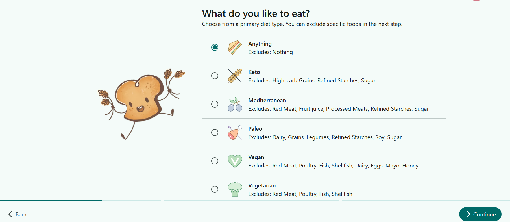
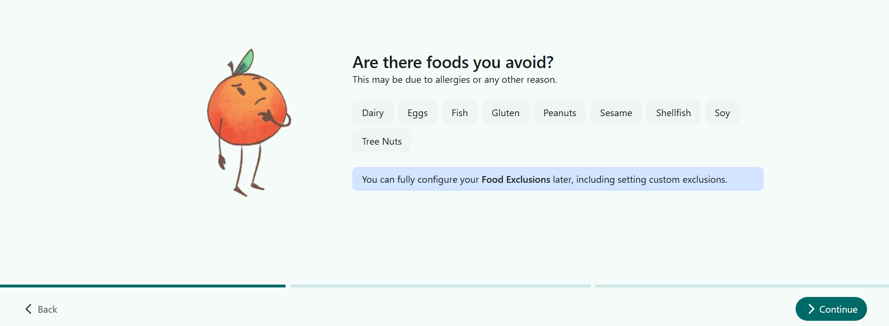
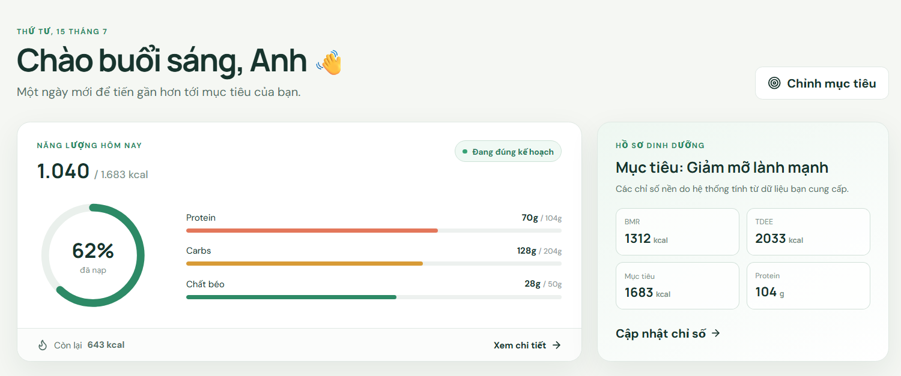
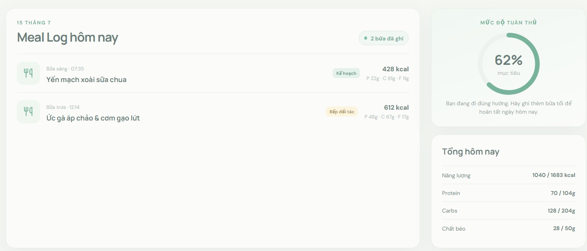
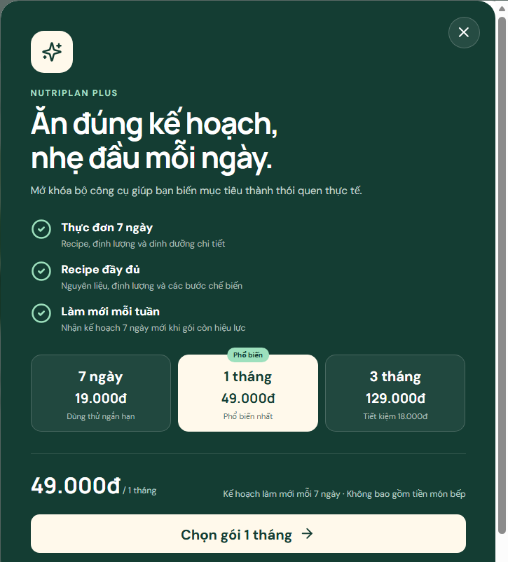
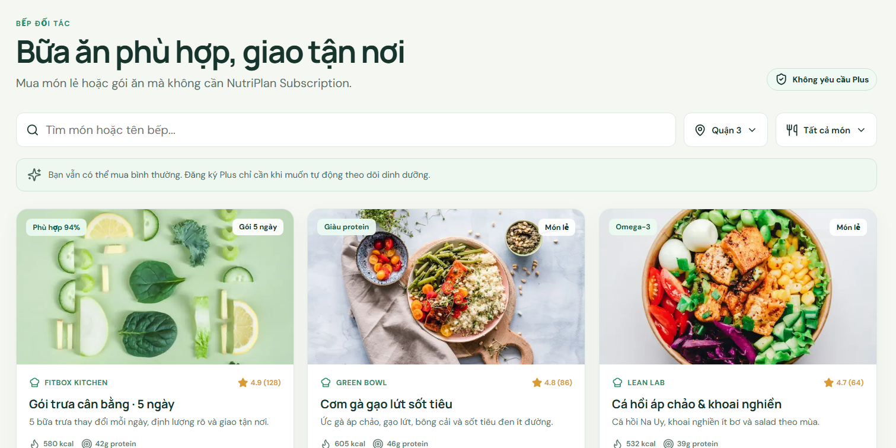

# Task 8 - Các Cột Mốc Phát Triển Sau Khi Nhận Vốn

## Marketing & Growth Lead

## Business Development & Customer Success

## CTO/Founding Engineer

## Lead Full-stack Developer & UI/UX Design

---

### Lộ Trình Phát Triển Sản Phẩm & Trải Nghiệm Người Dùng NutriPlan

#### Tổng Quan

Sau khi nhận vốn Pre-Seed, lộ trình phát triển sản phẩm được thiết kế trong **20 tuần (5 tháng)**, chia thành 4 giai đoạn rõ ràng. Mỗi giai đoạn đều hướng đến một cột mốc sản phẩm cụ thể, tập trung vào việc hoàn thiện giao diện người dùng (UI), nâng cao trải nghiệm (UX) và ra mắt từng phiên bản ứng dụng.

#### Bảng Tóm Tắt Cột Mốc theo Timeline

| Giai đoạn   | Thời gian    | Cột mốc sản phẩm & UI/UX chính                                                                                                                    |
| -------------| --------------| ---------------------------------------------------------------------------------------------------------------------------------------------------|
| Giai đoạn 1 | Tuần 1 - 4   | Thống nhất kiến trúc, database hệ thống & hoàn thiện flow ghi nhận thông tin dinh dưỡng, sức khỏe cá nhân & màn hình Đăng ký/Đăng nhập hoàn chỉnh |
| Giai đoạn 2 | Tuần 5 - 8   | Hoàn thiện chức năng miễn phí của ứng dụng (tính calorie, ghi lại và tính toán dinh dưỡng), phát hành Alpha nội bộ                                |
| Giai đoạn 3 | Tuần 9 - 14  | Hoàn thiện các tính năng trả phí (lên thực đơn tự động theo các đặc điểm của người dùng) & cổng thanh toán - phát hành bản Beta                   |
| Giai đoạn 4 | Tuần 15 - 20 | Hoàn thiện hệ sinh thái Bếp đối tác - phát hành chính thức v1.0                                                                                   |

---

## Chi Tiết Từng Giai Đoạn

### Giai đoạn 1: Nền tảng UI & Luồng Đăng ký (Tuần 1 - 4)

**Mục tiêu:** Xây dựng bộ nhận diện thương hiệu trên sản phẩm số và hoàn thiện trải nghiệm người dùng đầu tiên - từ khi mở app cho đến khi hoàn tất tạo tài khoản.

**Cột mốc UI/UX:**

* Hoàn thiện Design System (bảng màu, typography, spacing, icon set), database và bộ Mascot thương hiệu NutriPlan trên môi trường digital.
* Thiết kế và implement quá trình thu thập thông tin cá nhân khi đăng ký tài khoản với UX mượt mà, tránh gây friction.
* Hoàn thiện các màn hình xác thực: Đăng ký, Đăng nhập, Quên mật khẩu - đảm bảo chuẩn UX về thông báo lỗi và trạng thái loading.
* Thiết lập cấu trúc Frontend (React Native / Flutter) và kết nối API Xác thực cơ bản.

**Kết quả kỳ vọng cuối giai đoạn:** Người dùng có thể tải app, tạo tài khoản và hoàn thành bước thu thập chỉ số cơ thể ban đầu trong vòng dưới 3 phút.

---

### Giai đoạn 2: Giao diện Nhật ký Dinh dưỡng & Phát hành Alpha (Tuần 5 - 8)

**Mục tiêu:** Hoàn thiện tính năng cốt lõi giữ chân người dùng (Retention) - hệ thống ghi nhật ký và theo dõi dinh dưỡng hàng ngày.

**Cột mốc UI/UX:**

* Thiết kế và xây dựng màn hình Trang chủ hiển thị tóm tắt calo tiêu thụ, tiến trình đạt mục tiêu ngày và các bữa ăn đã ghi.
* Hoàn thiện tính năng Nhật ký Bữa ăn: thêm/sửa/xóa bữa ăn cho các khung Sáng, Trưa, Tối và Phụ; tích hợp tìm kiếm món ăn trong database nội bộ.
* Xây dựng màn hình Hồ sơ cá nhân hiển thị chỉ số BMI, TDEE, BMR được tính tự động và lịch sử nhật ký.
* Kiểm thử UX với người dùng thực - thu thập phản hồi và tối ưu luồng thao tác.

**Cột mốc sản phẩm:** Phát hành **Alpha nội bộ** cho nhóm nội bộ và nhóm người dùng thử nghiệm đóng (Closed Beta ~20 người).

**Kết quả kỳ vọng cuối giai đoạn:** Người dùng Alpha ghi được ít nhất 3 bữa ăn/ngày trong vòng 7 ngày liên tiếp; tốc độ phản hồi giao diện đạt dưới 200ms.

---

### Giai đoạn 3: Các tính năng trả phí & Phát hành Beta (Tuần 9 - 14)

**Mục tiêu:** Chuyển đổi người dùng Free sang NutriPlan Plus thông qua giao diện Premium và trải nghiệm thanh toán mượt mà.

**Cột mốc UI/UX:**

* Thiết kế và triển khai màn hình **Gợi ý Thực đơn Tự động (Auto Planner)** - hiển thị thực đơn hàng ngày/tuần được cá nhân hóa theo chỉ số BMR/TDEE và mục tiêu của người dùng (tính năng Plus).
* Xây dựng **Paywall thông minh** - giao diện hiển thị khi người dùng Free chạm giới hạn, trình bày lợi ích của gói Plus một cách thuyết phục, tối ưu tỉ lệ chuyển đổi (Conversion Rate).
* Hoàn thiện luồng **Thanh toán & Quản lý gói đăng ký**: tích hợp MoMo, VNPay; màn hình xác nhận, hóa đơn điện tử và thông báo gia hạn tự động.
* Triển khai ứng dụng lên môi trường Production (AWS EC2) - sẵn sàng cho người dùng bên ngoài truy cập.

**Cột mốc sản phẩm:** Phát hành **Beta giới hạn** (~200 người dùng) với đầy đủ tính năng Free và một phần tính năng Plus.

**Kết quả kỳ vọng cuối giai đoạn:** Đạt tỉ lệ chuyển đổi Free → Plus ≥ 5% trong nhóm Beta; không có lỗi nghiêm trọng nào trong luồng thanh toán.

---

### Giai đoạn 4: Hệ sinh thái Bếp Đối Tác & Ra mắt Chính Thức v1.0 (Tuần 15 - 20)

**Mục tiêu:** Hoàn thiện mô hình kinh doanh Hybrid bằng cách tích hợp trải nghiệm đặt cơm từ Bếp đối tác vào ứng dụng và phát hành phiên bản 1.0 ra thị trường.

**Cột mốc UI/UX:**

* Xây dựng tính năng Khám phá Bếp đối tác - hiển thị các combo thực đơn lành mạnh từ đối tác được nhúng vào kết quả gợi ý thực đơn một cách tự nhiên.
* Hoàn thiện luồng Mua đồ ăn: Giỏ hàng, thanh toán, chọn địa chỉ giao hàng và xác nhận đơn hàng.
* Thiết kế và phát triển bảng điều khiển riêng cho Bếp đối tác: quản lý menu, nhận đơn hàng real-time, cập nhật trạng thái đơn (Đang nấu / Đang giao / Đã giao) và xem báo cáo doanh thu.
* Tối ưu hóa hiệu năng giao diện: nén ảnh món ăn, cấu hình cache cho dữ liệu ít thay đổi, đảm bảo trải nghiệm mượt mà khi tải nhiều nội dung.
* Kiểm thử toàn diện End-to-End UX: chạy toàn bộ vòng đời người dùng (Đăng ký → Tracking → Nhận gợi ý → Đặt cơm Bếp đối tác → Giao hàng), phát hiện và sửa lỗi UX cuối cùng.

**Cột mốc sản phẩm:** Phát hành chính thức NutriPlan v1.0 trên App Store và Google Play.

**Kết quả kỳ vọng cuối giai đoạn:** Ứng dụng đạt rating ≥ 4.2/5 sao trên store trong 2 tuần đầu ra mắt; đủ khả năng phục vụ 1.000 người dùng đồng thời mà không có sự cố hạ tầng.

---

## Tổng Kết Cột Mốc Sản Phẩm

| Tuần    | Cột mốc                                                                   |
| ---------| ---------------------------------------------------------------------------|
| Tuần 4  | Hoàn thiện điền thông tin dinh dưỡng người dùng & luồng Đăng ký/Đăng nhập |
| Tuần 8  | Phát hành Alpha nội bộ - Nhật ký Dinh dưỡng hoạt động đầy đủ              |
| Tuần 14 | Phát hành Beta giới hạn - Tính năng Plus & Thanh toán live                |
| Tuần 20 | Ra mắt chính thức NutriPlan v1.0 trên App Store & Google Play             |

## Operations Manager - Logistics & Partners